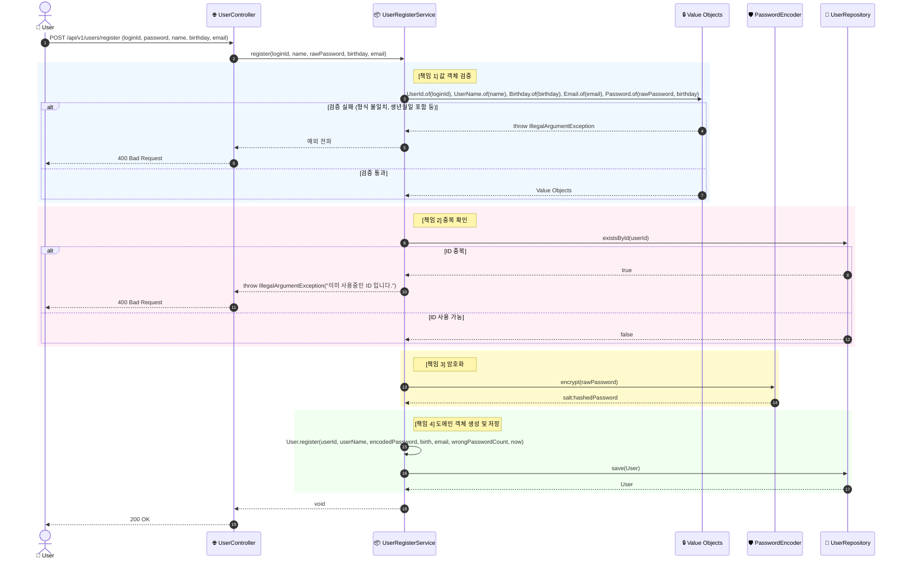
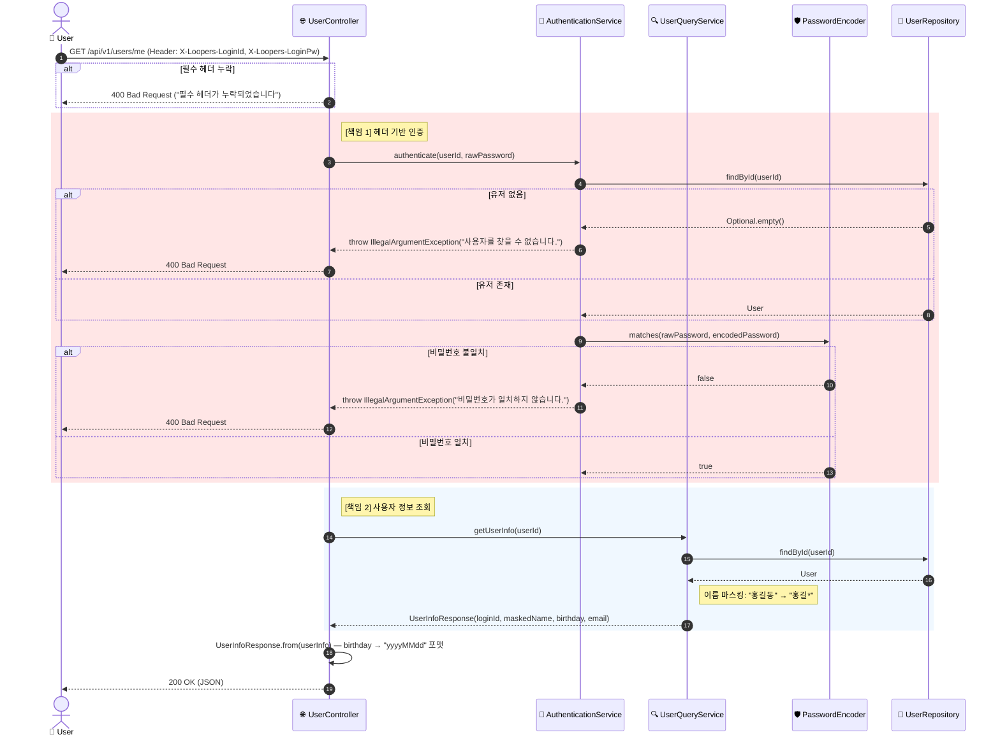
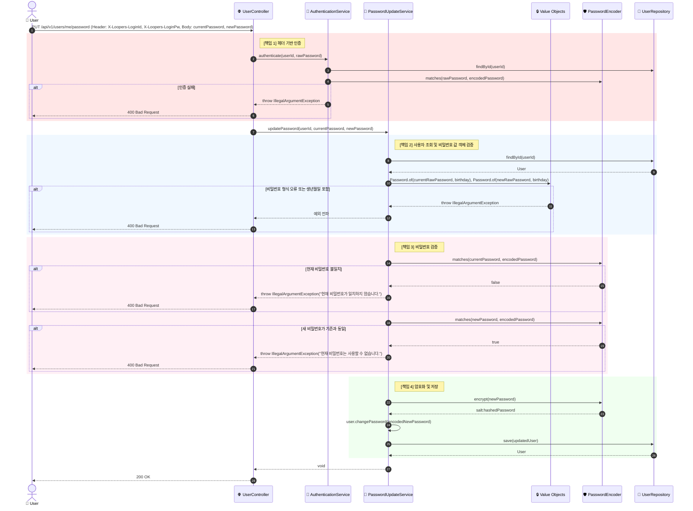
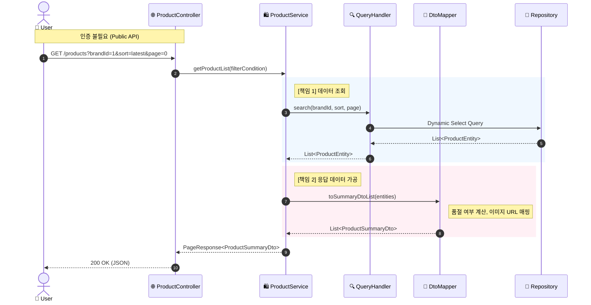
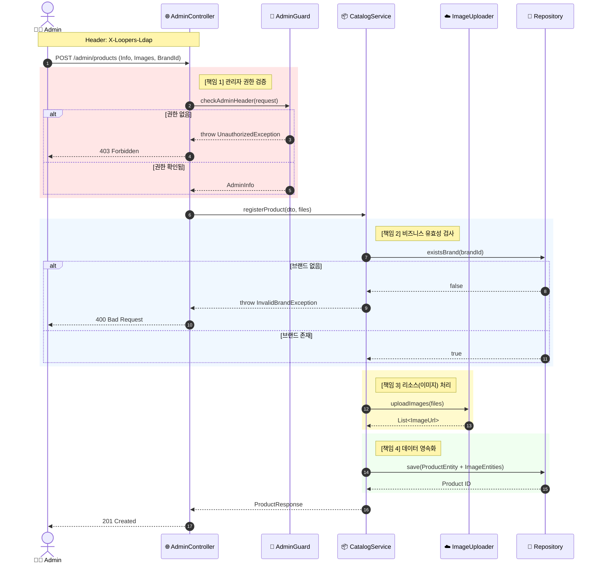

# 5. 시스템 시퀀스 다이어그램 (System Sequence Diagrams)

모든 핵심 기능(회원가입, 인증, 조회, 어드민 등록)에 대해 **객체의 역할과 책임(Responsibility)**이 명확히 드러나도록 시퀀스 다이어그램을 작성했습니다.

단순한 `Service` 하나가 모든 일을 다 하는 것이 아니라, **인증(Authentication), 값 객체 검증(Value Object), 암호화(Encoder), 조회(Query)** 등의 책임이 분리된 구조입니다.

| Flow | 핵심 책임 |
|------|-----------|
| User Flow | 회원가입, 헤더 기반 인증, 정보 조회, 비밀번호 변경 |
| Read Flow | 데이터 조회와 DTO 변환 |
| Write Flow (Admin) | 권한 체크와 데이터 무결성(참조 관계) |
| Order Flow | 재고/결제/스냅샷의 트랜잭션 |
| Coupon Flow | 동시성 제어(선착순) |

---

## 5-1. 회원 기능 (User Flow)

**핵심 책임 객체:**

| 객체 | 책임 |
|------|------|
| `UserController` | HTTP 요청 수신 및 UseCase 위임 |
| `UserRegisterService` | 회원가입 오케스트레이션 (값 객체 검증, 중복 확인, 암호화, 저장) |
| `AuthenticationService` | 헤더 기반 인증 (사용자 조회, 비밀번호 매칭) |
| `UserQueryService` | 사용자 정보 조회 및 이름 마스킹 |
| `PasswordUpdateService` | 비밀번호 변경 (기존 검증, 신규 검증, 암호화, 저장) |
| `PasswordEncoder` | 비밀번호 암호화 및 매칭 (SHA-256) |
| `UserRepository` | 중복 ID 체크 및 사용자 영속화 |

### Scenario 1 — 회원가입 (Register)

### Scenario 2 — 내 정보 조회 (Get My Info)

### Scenario 3 — 비밀번호 변경 (Update Password)

---

## 5-2. 브랜드 및 상품 조회 (Public Read Flow)

**핵심 책임 객체:**

| 객체 | 책임 |
|------|------|
| `QueryHandler` | 복잡한 검색/필터링 쿼리 처리 (QueryDSL 등) |
| `DtoMapper` | 엔티티 → API 응답 객체 변환 (민감 정보 제외, 포맷팅) |

---

## 5-3. 브랜드 및 상품 등록 (Admin Write Flow)

**핵심 책임 객체:**

| 객체 | 책임 |
|------|------|
| `AdminGuard` | 관리자 권한 및 헤더 검증 (AOP/Interceptor) |
| `ImageUploader` | 이미지 파일 외부 저장소 업로드 (S3 등) |
| `CatalogService` | 브랜드 유효성 검증 및 상품 등록 오케스트레이션 |

---