# 헥사고날 아키텍처 - User 도메인 설계

## 아키텍처 개요

클린 아키텍처 기반으로 **도메인 계층이 어떤 외부 기술에도 의존하지 않도록** 설계했습니다.

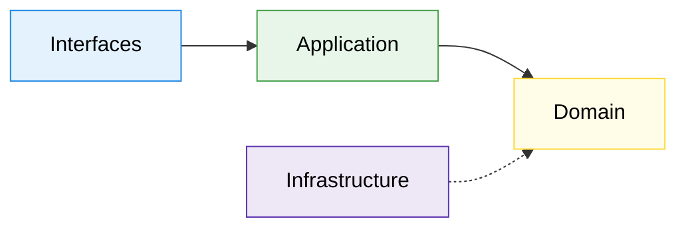

## UML 관계 범례

| 관계 | Mermaid 표기 | 설명 |
|---|---|---|
| 일반화(Generalization) | `--|>` 실선 + 빈 삼각형 | 상속 (extends) |
| 실체화(Realization) | `..|>` 점선 + 빈 삼각형 | 구현 (implements) |
| 의존(Dependency) | `..>` 점선 화살표 | 메서드 파라미터/로컬 변수로 참조 |
| 연관(Association) | `-->` 실선 화살표 | 필드로 참조 |
| 합성(Composition) | `*--` 채워진 다이아몬드 | 강한 소유 (생명주기 종속) |
| 집합(Aggregation) | `o--` 빈 다이아몬드 | 약한 소유 (독립 생명주기) |

---

## 전체 아키텍처 클래스 다이어그램

> 다이어그램이 크므로 **상위 레이어**(Interfaces → Application)와 **하위 레이어**(Domain ← Infrastructure)로 나눠서 보여줍니다.

---

## Part A. Interfaces → Application (요청 흐름)

> **AuthenticationInterceptor**가 인증을 전담하고, Controller는 비즈니스 UseCase만 의존합니다. 인증 로직은 **AuthenticationService**로 분리되었습니다.

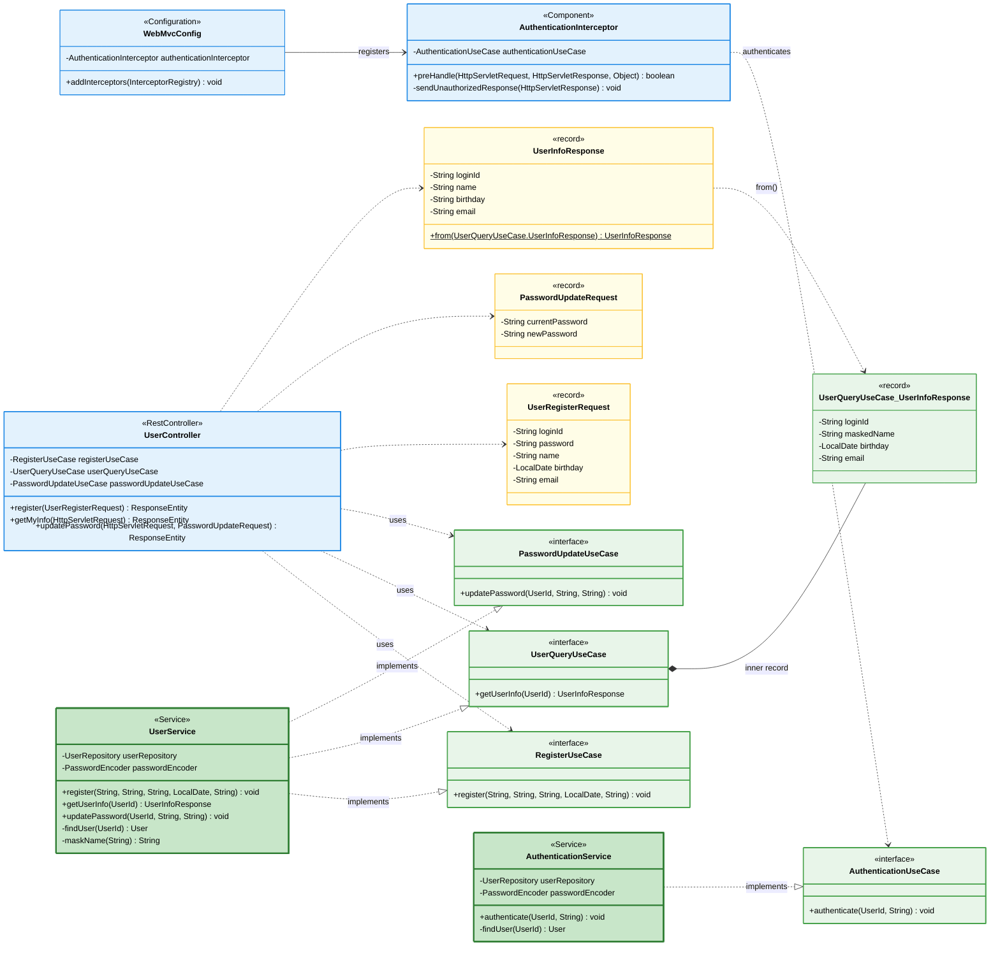

### 이 다이어그램에서 봐야 할 포인트

- **인증 관심사 분리**: `AuthenticationInterceptor`가 `/api/v1/users/me/**` 경로의 인증을 전담한다. Controller는 `AuthenticationUseCase`를 더 이상 알지 못하며, `HttpServletRequest`의 `authenticatedUserId` 속성에서 인증된 사용자를 꺼내 쓴다.
- **Service 분리**: `UserService`는 Register, Query, PasswordUpdate만 구현하고, `AuthenticationService`가 인증만 전담한다. 향후 도메인(주문, 좋아요 등)이 추가되어도 각 도메인별 Service가 독립적으로 존재하는 패턴의 기반이 된다.
- **Interceptor 등록**: `WebMvcConfig`가 `AuthenticationInterceptor`를 인증이 필요한 경로에만 등록한다. `/api/v1/users/register`는 인증 없이 접근 가능하다.

### 설계 의도

- **UseCase 인터페이스 분리 + Service 구현체 분리**: 이전에는 `UserService`가 4개 UseCase를 모두 구현했으나, 인증이 도메인 로직이 아닌 횡단 관심사임을 인식하여 `AuthenticationService`로 분리했다.
- **Interceptor 패턴**: Controller에서 반복되던 인증 호출 코드를 Interceptor로 추출하여, 새로운 인증 필요 API가 추가되어도 경로만 등록하면 된다.
- `UserQueryUseCase` 안에 `UserInfoResponse` inner record를 두어, 반환 타입이 Application 레이어에서 정의된다. Interfaces 레이어의 DTO와 분리하여 레이어 간 결합을 끊는다.

### 이전 버전과의 차이

| 항목 | Before | After |
|---|---|---|
| 인증 호출 위치 | Controller에서 직접 `authenticationUseCase.authenticate()` | Interceptor `preHandle()`에서 처리 |
| UserService 역할 | 4개 UseCase 모두 구현 | Register, Query, PasswordUpdate만 구현 |
| 인증 실패 응답 | 400 Bad Request | 401 Unauthorized |
| Controller 의존성 | 4개 UseCase | 3개 UseCase (인증 제거) |

---

## Part B. Domain ← Infrastructure (핵심 도메인 + 어댑터)

> Domain의 포트(interface)를 Infrastructure가 **실체화(Realization)** 합니다. User 애그리거트는 Value Object를 **합성(Composition)** 합니다.

```mermaid
classDiagram
    direction TB

    %% ═══════════════════════════════════════
    %% Application (연결점)
    %% ═══════════════════════════════════════
    class UserService {
        <<Service>>
        -UserRepository userRepository
        -PasswordEncoder passwordEncoder
    }
    class AuthenticationService {
        <<Service>>
        -UserRepository userRepository
        -PasswordEncoder passwordEncoder
    }

    %% ═══════════════════════════════════════
    %% Domain Layer
    %% ═══════════════════════════════════════
    class User {
        <<Aggregate Root>>
        -Long id
        -UserId userId
        -UserName userName
        -String encodedPassword
        -Birthday birth
        -Email email
        -WrongPasswordCount wrongPasswordCount
        -LocalDateTime createdAt
        +register() User$
        +reconstitute() User$
        +matchesPassword(Password, PasswordMatchChecker) boolean
        +changePassword(String) User
    }
    class PasswordMatchChecker {
        <<interface>>
        <<FunctionalInterface>>
        +matches(String, String) boolean
    }
    class UserId {
        <<Value Object>>
        -String value
    }
    class UserName {
        <<Value Object>>
        -String value
    }
    class Password {
        <<Value Object>>
        -String value
    }
    class Email {
        <<Value Object>>
        -String value
    }
    class Birthday {
        <<Value Object>>
        -LocalDate value
    }
    class WrongPasswordCount {
        <<Value Object>>
        -int value
    }
    class UserRepository {
        <<interface>>
        <<Domain Port>>
        +save(User) User
        +findById(UserId) User?
        +existsById(UserId) boolean
    }
    class PasswordEncoder {
        <<interface>>
        <<Domain Port>>
        +encrypt(String) String
        +matches(String, String) boolean
    }

    %% ═══════════════════════════════════════
    %% Infrastructure Layer
    %% ═══════════════════════════════════════
    class UserRepositoryImpl {
        <<Repository>>
        <<Adapter>>
        -UserJpaRepository userJpaRepository
        +save(User) User
        +findById(UserId) User?
        +existsById(UserId) boolean
        -toEntity(User) UserJpaEntity
        -toDomain(UserJpaEntity) User
    }
    class UserJpaRepository {
        <<interface>>
        <<Spring Data JPA>>
        +findByUserId(String) UserJpaEntity?
        +existsByUserId(String) boolean
    }
    class UserJpaEntity {
        <<Entity>>
        -Long id
        -String userId
        -String encodedPassword
        -String username
        -LocalDate birthday
        -String email
        -LocalDateTime createdAt
    }
    class JpaRepositoryBase {
        <<interface>>
        <<Spring Data>>
    }
    class Sha256PasswordEncoder {
        <<Component>>
        <<Adapter>>
        +encrypt(String) String
        +matches(String, String) boolean
        -generateSalt() String
        -sha256(String) String
    }

    %% --- Application → Domain (연관) ---
    UserService --> UserRepository : -userRepository
    UserService --> PasswordEncoder : -passwordEncoder
    UserService ..> User : uses
    AuthenticationService --> UserRepository : -userRepository
    AuthenticationService --> PasswordEncoder : -passwordEncoder
    AuthenticationService ..> User : uses

    %% --- 합성 (Composition): User → Value Objects ---
    User *-- "1" UserId : -userId
    User *-- "1" UserName : -userName
    User *-- "1" Birthday : -birth
    User *-- "1" Email : -email
    User *-- "1" WrongPasswordCount : -wrongPasswordCount

    %% --- 의존 (Dependency): 메서드에서만 사용 ---
    User ..> Password : 생성/변경 시 검증
    User ..> PasswordMatchChecker : matchesPassword()

    %% --- 실체화 (Realization): Infrastructure → Domain Port ---
    UserRepositoryImpl ..|> UserRepository : implements
    Sha256PasswordEncoder ..|> PasswordEncoder : implements

    %% --- 일반화 (Generalization): JPA 상속 ---
    UserJpaRepository --|> JpaRepositoryBase : extends

    %% --- 연관/의존: Infrastructure 내부 ---
    UserRepositoryImpl --> "1" UserJpaRepository : -userJpaRepository
    UserRepositoryImpl ..> UserJpaEntity : toEntity() / toDomain()

    %% ═══════════════════════════════════════
    %% Styling
    %% ═══════════════════════════════════════
    
    %% Application
    style UserService fill:#c8e6c9,stroke:#2e7d32,stroke-width:3px,color:#000
    style AuthenticationService fill:#c8e6c9,stroke:#2e7d32,stroke-width:3px,color:#000

    %% Domain - Aggregate Root
    style User fill:#ffecb3,stroke:#ff6f00,stroke-width:3px,color:#000
    
    %% Domain - Value Objects
    style UserId fill:#fff9c4,stroke:#fbc02d,stroke-width:1px,color:#000
    style UserName fill:#fff9c4,stroke:#fbc02d,stroke-width:1px,color:#000
    style Password fill:#fff9c4,stroke:#fbc02d,stroke-width:1px,color:#000
    style Email fill:#fff9c4,stroke:#fbc02d,stroke-width:1px,color:#000
    style Birthday fill:#fff9c4,stroke:#fbc02d,stroke-width:1px,color:#000
    style WrongPasswordCount fill:#fff9c4,stroke:#fbc02d,stroke-width:1px,color:#000
    
    %% Domain - Ports
    style UserRepository fill:#fffde7,stroke:#fdd835,stroke-width:2px,color:#000
    style PasswordEncoder fill:#fffde7,stroke:#fdd835,stroke-width:2px,color:#000
    style PasswordMatchChecker fill:#fffde7,stroke:#fdd835,stroke-width:2px,color:#000
    
    %% Infrastructure - Adapters
    style UserRepositoryImpl fill:#ede7f6,stroke:#5e35b1,stroke-width:2px,color:#000
    style Sha256PasswordEncoder fill:#ede7f6,stroke:#5e35b1,stroke-width:2px,color:#000
    
    %% Infrastructure - JPA
    style UserJpaRepository fill:#eeeeee,stroke:#9e9e9e,stroke-width:1px,color:#000
    style JpaRepositoryBase fill:#eeeeee,stroke:#9e9e9e,stroke-width:1px,color:#000
    style UserJpaEntity fill:#eeeeee,stroke:#9e9e9e,stroke-width:1px,color:#000
```

### 이 다이어그램에서 봐야 할 포인트

- 화살표 방향에 주목: `UserService → UserRepository(interface) ← UserRepositoryImpl`. Domain Port를 사이에 두고 Application과 Infrastructure가 **서로를 직접 모르는 구조**다. 이것이 의존성 역전(DIP)의 핵심이다.
- User가 6개의 Value Object를 합성(Composition)하고 있다. Value Object는 User 없이 독립 존재하지 않으므로 채워진 다이아몬드(`*--`)로 표현한다.
- `PasswordMatchChecker`는 `@FunctionalInterface`다. User 도메인이 암호화 구현을 모르면서도 비밀번호 매칭을 할 수 있게 하는 전략 패턴이다.

### 잠재 리스크

| 리스크 | 설명 | 선택지 |
|---|---|---|
| 도메인 ↔ JPA 변환 비용 | `toEntity()` / `toDomain()`을 매번 호출. 엔티티가 복잡해지면 변환 로직 유지보수 부담 증가 | **A)** 현행 유지 — 도메인 순수성의 대가로 감수 **B)** MapStruct 등 매핑 라이브러리 도입 |
| WrongPasswordCount 영속 누락 | 도메인에는 존재하지만 DB에 저장하지 않아, `toDomain()` 시 항상 0으로 복원됨 | ERD 문서의 데이터 정합성 섹션 참고 |
| Value Object 검증이 앱 레벨에만 존재 | DB 레벨에는 `NOT NULL`과 `UNIQUE` 외에 검증 없음. 직접 SQL 실행 시 도메인 규칙 우회 가능 | **A)** 운영 DDL에 CHECK 제약 추가 **B)** DB는 저장소 역할에 한정하고, 앱 레벨 검증만으로 충분하다고 판단 |

---

## Value Objects 상세 다이어그램

> User 애그리거트가 소유하는 값 객체들의 **합성(Composition)** 관계와 검증 규칙을 보여줍니다.

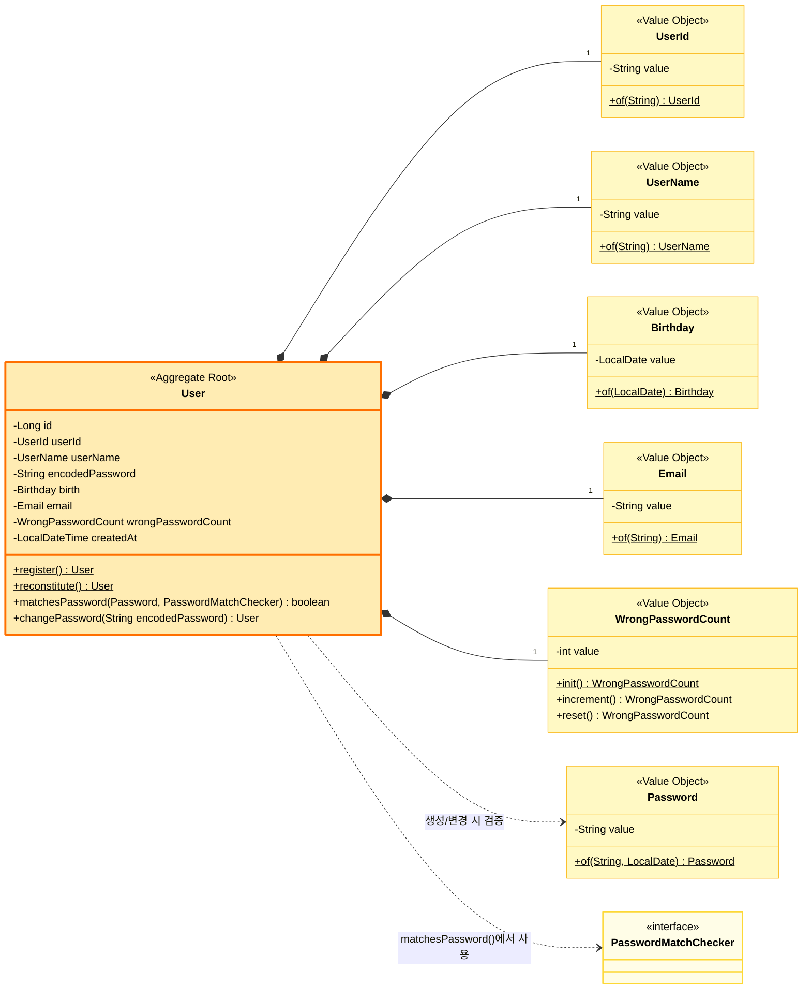

### Value Object 검증 규칙

| Value Object | 검증 규칙 | 예외 메시지 |
|---|---|---|
| `UserId` | 4~10자, 영문 소문자+숫자만 | `로그인 ID는 4~10자의 영문 소문자, 숫자만 가능합니다.` |
| `UserName` | 2~20자, 한글/영문/숫자 | `이름은 2~20자의 한글 또는 영문만 가능합니다.` |
| `Password` | 8~16자, 영문+숫자+특수문자, 생년월일 포함 불가 | `비밀번호는 8~16자리 영문 대소문자, 숫자, 특수문자만 가능합니다.` |
| `Email` | 이메일 형식 정규식 | `올바른 이메일 형식이 아닙니다` |
| `Birthday` | not null, 미래 불가, 1900년 이후 | `생년월일은 미래 날짜일 수 없습니다.` |
| `WrongPasswordCount` | 음수 불가, 5회 이상 잠금 | `비밀번호 오류 횟수는 음수일 수 없습니다.` |

---

## Infrastructure 계층 상세

> 도메인 인터페이스를 **실체화(Realization)** 하는 인프라 어댑터와 JPA 엔티티 매핑을 보여줍니다.

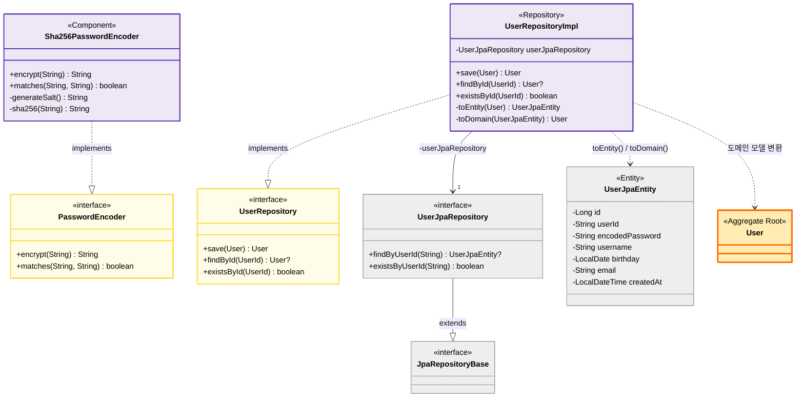

### Entity Mapping

```java
// Domain → Persistence
UserRepositoryImpl.toEntity(User) → UserJpaEntity

// Persistence → Domain  
UserRepositoryImpl.toDomain(UserJpaEntity) → User
```

---

## 에러 처리 다이어그램


---

## 전체 아키텍처 요약

### 전체 흐름도

```
┌─────────────────────────────────────────────┐
│   Interface Layer                            │
│   (Interceptor, Controller, Config, DTOs)    │ ← REST API + 인증
├─────────────────────────────────────────────┤
│   Application Layer                          │
│   (UseCases, UserService,                    │
│    AuthenticationService)                    │ ← 비즈니스 로직
├─────────────────────────────────────────────┤
│   Domain Layer                               │
│   (User, Value Objects, Ports)               │ ← 핵심 도메인
├─────────────────────────────────────────────┤
│   Infrastructure Layer                       │
│   (Adapters)                                 │ ← 기술 구현
├─────────────────────────────────────────────┤
│   Persistence Layer                          │
│   (JPA, Entity)                              │ ← 데이터베이스
└─────────────────────────────────────────────┘
```

### 요청 처리 흐름 예시 (인증 필요 API)

1. **HTTP Request** → `AuthenticationInterceptor.preHandle()`
2. **Interceptor** → 헤더에서 `X-Loopers-LoginId`, `X-Loopers-LoginPw` 추출
3. **Interceptor** → `AuthenticationUseCase.authenticate()` 호출
4. **인증 성공** → `request.setAttribute("authenticatedUserId", userId)`
5. **Controller** → `request.getAttribute("authenticatedUserId")`로 UserId 획득
6. **Controller** → `UserQueryUseCase.getUserInfo(userId)` 호출
7. **Service** → Domain 로직 실행 → Repository 호출 → 응답 반환

### 요청 처리 흐름 예시 (인증 불필요 API)

1. **HTTP Request** → `UserController.register()` (Interceptor 미적용)
2. **Controller** → `RegisterUseCase.register()` 호출
3. **Service** → `User.register()` → `UserRepository.save()` → 응답 반환

### 의존성 방향

```
Interface → Application → Domain ← Infrastructure ← Persistence
                            ↑              ↓
                            └──────────────┘
                            (의존성 역전)
```

### 핵심 원칙

1. ✅ **도메인 독립성**: Domain은 외부 기술에 의존하지 않음
2. ✅ **의존성 역전**: Infrastructure가 Domain을 구현
3. ✅ **Port & Adapter**: 인터페이스(Port)와 구현(Adapter) 분리
4. ✅ **불변성**: Value Object는 모두 불변
5. ✅ **응집도**: 관련된 로직은 한 곳에 모음
6. ✅ **테스트 용이성**: 각 레이어를 독립적으로 테스트 가능

### 레이어별 색상 가이드

| 레이어 | 색상 | 설명 |
|--------|------|------|
| Interface | 🔵 파란색 | REST API, DTOs |
| Application | 🟢 초록색 | UseCases, Service |
| Domain (Aggregate) | 🟠 주황색 | User (Aggregate Root) |
| Domain (Value Object) | 🟡 노란색 | 불변 값 객체들 |
| Domain (Port) | 🟡 진한 노란색 | 인터페이스 |
| Infrastructure | 🟣 보라색 | Adapter 구현체 |
| Persistence | ⚪ 회색 | JPA, Entity |

---

## Part E. Brand 도메인

> 관리자가 브랜드를 CRUD하고, 일반 유저는 조회만 가능합니다.

### E-1. Interfaces → Application

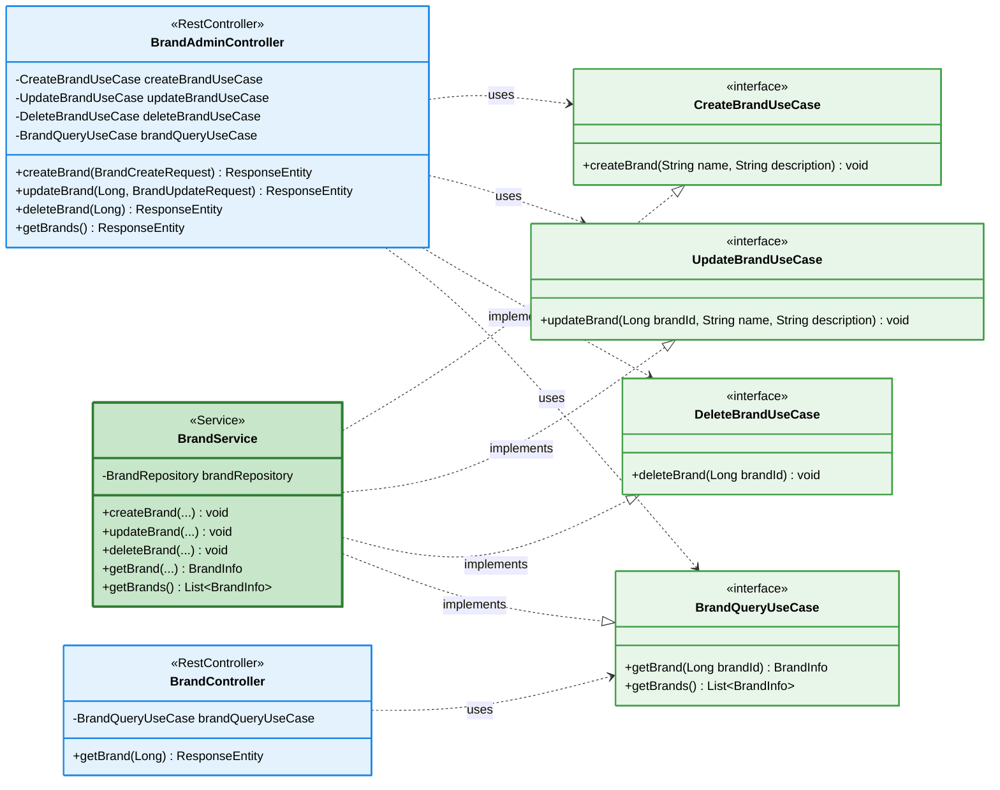

### E-2. Domain

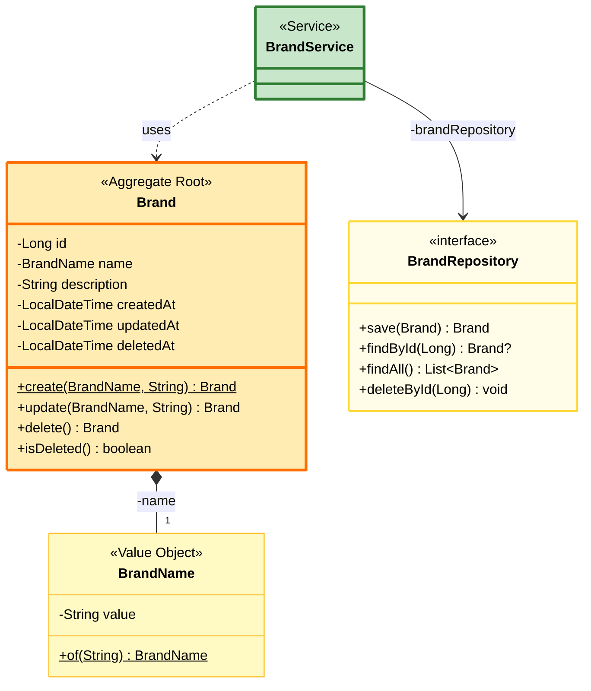

### 설계 포인트

- Admin과 User가 별도 Controller. Admin은 CRUD 전체, User는 조회만 가능.
- Brand 삭제는 Soft Delete (`deletedAt` 설정). 하위 Product도 Cascade Soft Delete 처리 필요.
- `BrandName`은 Value Object로 중복 검증 로직을 캡슐화.

---

## Part F. Product 도메인

> 관리자가 상품을 등록/수정/삭제하고, 일반 유저는 목록/상세 조회합니다. Command와 Query Service를 분리합니다.

### F-1. Interfaces → Application

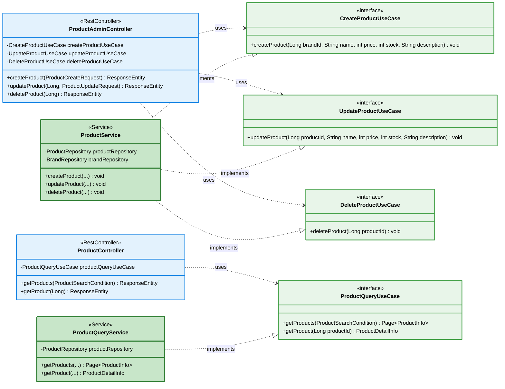

### F-2. Domain

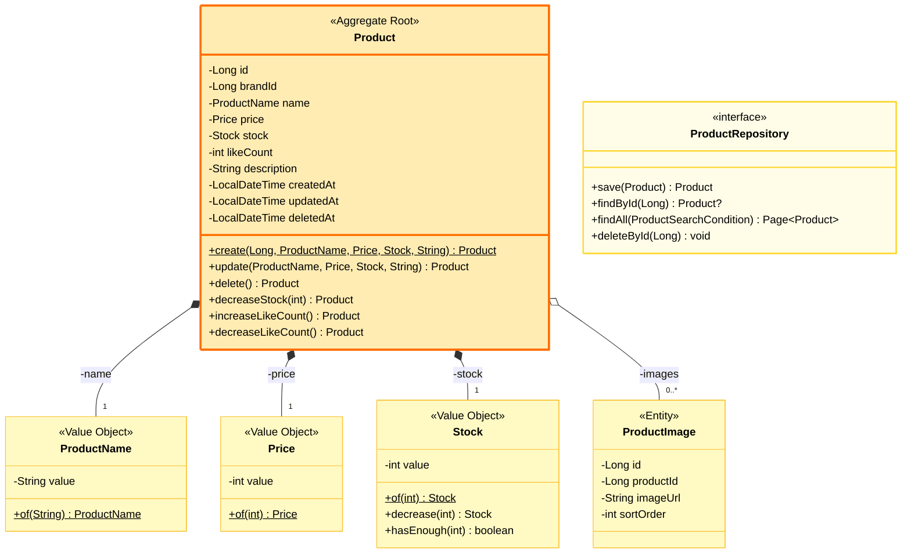

### 설계 포인트

- **Command/Query 분리**: `ProductService`(CUD)와 `ProductQueryService`(R)를 분리하여 읽기 최적화와 쓰기 트랜잭션을 독립시킨다.
- `brandId`는 Product가 Brand Aggregate를 직접 참조하지 않고 **ID 참조**로 연결. Aggregate 간 결합도를 낮춘다.
- `Stock` Value Object에 `decrease()`, `hasEnough()` 로직을 캡슐화하여 재고 관련 규칙이 도메인에 집중된다.
- `likeCount`는 비정규화 필드. LIKES 테이블과의 정합성은 서비스 레이어에서 트랜잭션으로 보장.
- 브랜드 변경 불가(`Immutable`) --- `update()`에 brandId 파라미터 없음.

---

## Part G. Like 도메인

> 인증된 유저가 상품에 좋아요를 등록/취소하고, 내 좋아요 목록을 조회합니다.

### G-1. Interfaces → Application

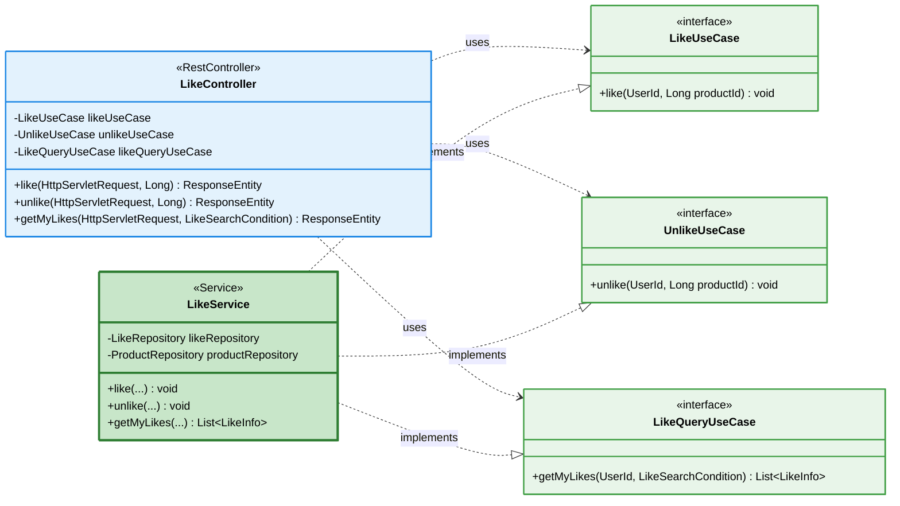

### G-2. Domain

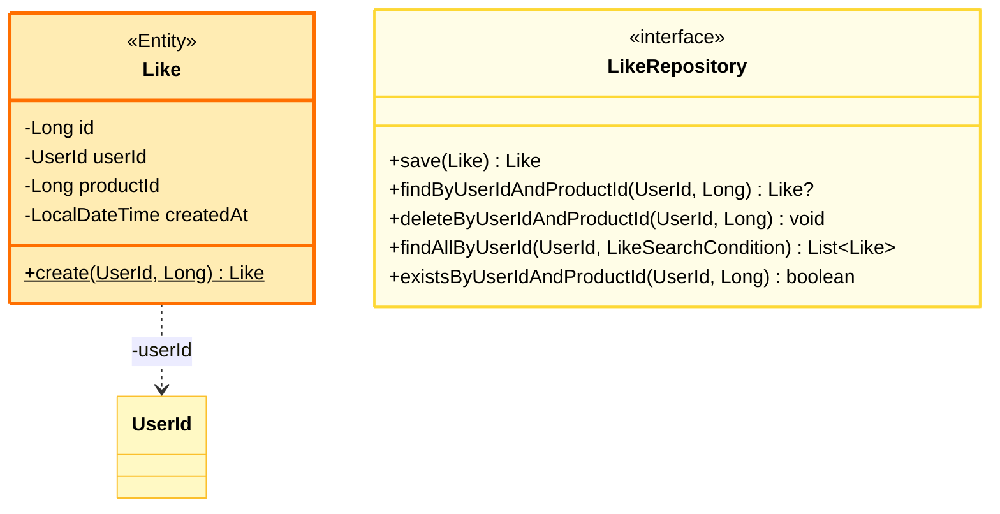

### 설계 포인트

- Like는 독립 Aggregate가 아닌 **Entity**. User와 Product 사이의 관계를 ID 참조로만 연결.
- **Idempotency**: `like()` 호출 시 이미 좋아요가 존재하면 중복 저장하지 않음.
- Like 생성/삭제 시 `Product.likeCount`를 같은 트랜잭션에서 증감하여 정합성 보장.
- Controller는 `HttpServletRequest`에서 `authenticatedUserId`를 획득 (AuthenticationInterceptor 패턴).

---

## Part H. Order 도메인

> 인증된 유저가 주문을 생성하고, 주문 내역을 조회합니다. 관리자는 전체 주문을 조회합니다.

### H-1. Interfaces → Application

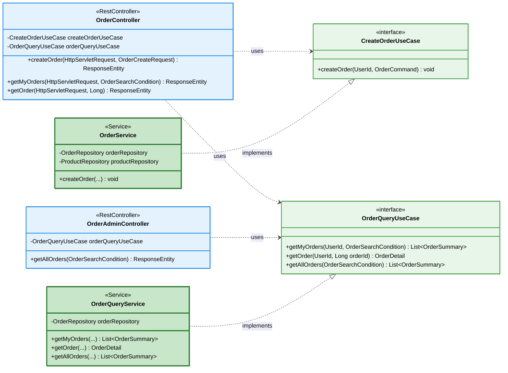

### H-2. Domain

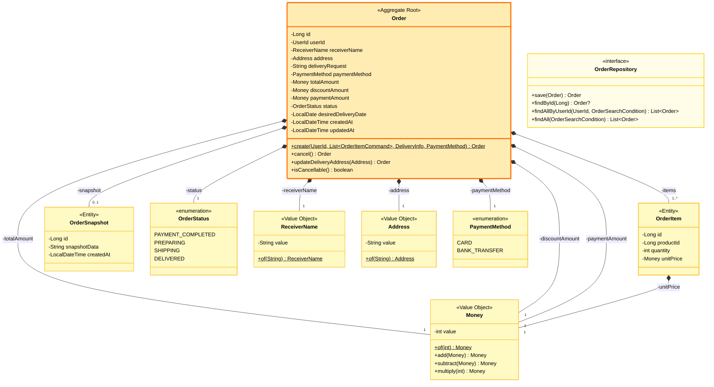

### 설계 포인트

- **Order가 Aggregate Root**, OrderItem과 OrderSnapshot은 Order 생명주기에 종속된 Entity.
- **주문 생성 프로세스**: 재고 확인 → 재고 차감 → (쿠폰 적용) → 금액 검증 → 주문 생성. 하나의 트랜잭션.
- `OrderItem.unitPrice`는 주문 시점 스냅샷. `Product.price` 변경에 영향받지 않음.
- **상태 전이 규칙**: `PAYMENT_COMPLETED`/`PREPARING`에서만 취소/배송지 변경 가능.
- `Money` Value Object로 금액 연산을 캡슐화.

---

## Part I. 도메인 간 관계 종합

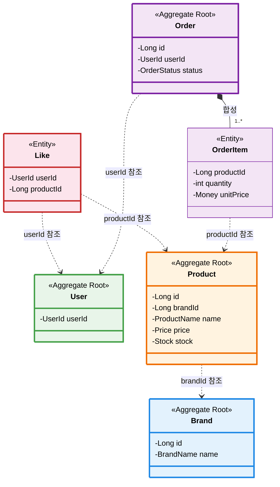

### Aggregate 간 참조 규칙

| 참조 | 방식 | 이유 |
|---|---|---|
| Product → Brand | `brandId` (Long) | 다른 Aggregate를 직접 참조하지 않아 결합도 최소화 |
| Like → User | `userId` (UserId) | User Aggregate의 식별자만 사용 |
| Like → Product | `productId` (Long) | Product Aggregate의 식별자만 사용 |
| Order → User | `userId` (UserId) | 주문자 식별 |
| OrderItem → Product | `productId` (Long) | 주문 시점 단가를 OrderItem에 스냅샷 |