# 6. 도메인 객체 설계 (Class Diagram)

클린 아키텍처(Clean Architecture) 기반으로 **도메인 계층이 어떤 외부 기술에도 의존하지 않도록** 설계했습니다.

각 계층의 의존 방향은 항상 **바깥 → 안쪽**이며, 도메인 계층은 순수 Java 객체로만 구성됩니다.

```
Interfaces → Application → Domain ← Infrastructure
```

---

## 6-1. 전체 아키텍처 계층 구조

```mermaid
classDiagram
    direction TB

    namespace Interfaces {
        class UserController
        class UserRegisterRequest
        class UserInfoResponse
        class PasswordUpdateRequest
    }

    namespace Application {
        class RegisterUseCase
        class AuthenticationUseCase
        class UserQueryUseCase
        class PasswordUpdateUseCase
        class UserRegisterService
        class AuthenticationService
        class UserQueryService
        class PasswordUpdateService
    }

    namespace Domain {
        class User
        class UserId
        class UserName
        class Password
        class Email
        class Birthday
        class WrongPasswordCount
        class PasswordEncoder
        class UserRepository
    }

    namespace Infrastructure {
        class UserRepositoryImpl
        class UserJpaRepository
        class UserJpaEntity
        class Sha256PasswordEncoder
    }

    UserController --> RegisterUseCase
    UserController --> AuthenticationUseCase
    UserController --> UserQueryUseCase
    UserController --> PasswordUpdateUseCase

    UserRegisterService ..|> RegisterUseCase
    AuthenticationService ..|> AuthenticationUseCase
    UserQueryService ..|> UserQueryUseCase
    PasswordUpdateService ..|> PasswordUpdateUseCase

    UserRegisterService --> UserRepository
    UserRegisterService --> PasswordEncoder
    AuthenticationService --> UserRepository
    AuthenticationService --> PasswordEncoder
    UserQueryService --> UserRepository
    PasswordUpdateService --> UserRepository
    PasswordUpdateService --> PasswordEncoder

    UserRepositoryImpl ..|> UserRepository
    Sha256PasswordEncoder ..|> PasswordEncoder
    UserRepositoryImpl --> UserJpaRepository
```



---

## 6-2. Domain 계층 — Aggregate Root & Value Objects

도메인 모델은 **불변(Immutable) 객체** 기반으로 설계했습니다.

`User`는 Aggregate Root이며, 모든 필드는 값 객체(Value Object)로 감싸서 **자기 검증(Self-Validating)** 책임을 가집니다.

```mermaid
classDiagram
    class User {
        -Long id
        -UserId userId
        -UserName userName
        -String encodedPassword
        -Birthday birth
        -Email email
        -WrongPasswordCount wrongPasswordCount
        -LocalDateTime createdAt
        +register(userId, userName, encodedPassword, birth, email, wrongPasswordCount, createdAt)$ User
        +reconstitute(id, userId, userName, encodedPassword, birth, email, wrongPasswordCount, createdAt)$ User
        +matchesPassword(Password, PasswordMatchChecker) boolean
        +changePassword(String newEncodedPassword) User
    }

    class PasswordMatchChecker {
        <<functional interface>>
        +matches(Password, String encodingPassword) boolean
    }

    class UserId {
        -String value
        -Pattern PATTERN = "^[a-z0-9]&#123;4,10&#125;$"
        +of(String value)$ UserId
    }

    class UserName {
        -String value
        -Pattern PATTERN = "^[a-zA-Z0-9가-힣]&#123;2,20&#125;$"
        +of(String value)$ UserName
    }

    class Password {
        -String value
        +of(String rawPassword, LocalDate birthday)$ Password
        +containsBirthday(String, LocalDate)$ boolean
    }

    class Email {
        -String value
        -Pattern PATTERN = "^[a-zA-Z0-9]+@..."
        +of(String value)$ Email
    }

    class Birthday {
        -LocalDate value
        +of(LocalDate value)$ Birthday
    }

    class WrongPasswordCount {
        -int value
        +init()$ WrongPasswordCount
        +of(int value)$ WrongPasswordCount
        +increment() WrongPasswordCount
        +reset() WrongPasswordCount
        +isLocked() boolean
    }

    User *-- UserId
    User *-- UserName
    User *-- Birthday
    User *-- Email
    User *-- WrongPasswordCount
    User ..> Password : matchesPassword()에서 사용
    User +-- PasswordMatchChecker
```

### 값 객체 검증 규칙

| Value Object | 검증 규칙 | 예외 메시지 |
|---|---|---|
| `UserId` | 4~10자, 영문 소문자+숫자만 | `로그인 ID는 4~10자의 영문 소문자, 숫자만 가능합니다.` |
| `UserName` | 2~20자, 한글/영문/숫자 | `이름은 2~20자의 한글 또는 영문만 가능합니다.` |
| `Password` | 8~16자, 영문+숫자+특수문자, 생년월일 포함 불가 | `비밀번호는 8~16자리 영문 대소문자, 숫자, 특수문자만 가능합니다.` |
| `Email` | 이메일 형식 정규식 검증 | `올바른 이메일 형식이 아닙니다` |
| `Birthday` | not null, 미래 날짜 불가, 1900년 이후 | `생년월일은 미래 날짜일 수 없습니다.` |
| `WrongPasswordCount` | 음수 불가, 5회 이상이면 잠금 | `비밀번호 오류 횟수는 음수일 수 없습니다.` |

### 설계 결정

- **`User.register()`**: id = null로 생성 (영속화 전 신규 객체)
- **`User.reconstitute()`**: DB에서 복원할 때 사용 (id 포함)
- **`User.changePassword()`**: 새로운 User 인스턴스 반환 (불변성 유지)
- **`PasswordMatchChecker`**: 함수형 인터페이스로 도메인이 암호화 구현에 의존하지 않도록 설계

---

## 6-3. Domain 계층 — Repository & Domain Service 인터페이스

도메인 계층은 인터페이스만 정의하고, 구현은 Infrastructure 계층에 위임합니다 (의존성 역전 원칙).


---

## 6-4. Application 계층 — UseCase 인터페이스 & Service 구현

UseCase 인터페이스는 Controller가 의존하는 **입력 포트(Input Port)** 역할을 합니다.

각 Service는 **하나의 UseCase만 구현**하여 단일 책임 원칙(SRP)을 따릅니다.

```mermaid
classDiagram
    class RegisterUseCase {
        <<interface>>
        +register(String loginId, String name, String rawPassword, LocalDate birthday, String email) void
    }

    class AuthenticationUseCase {
        <<interface>>
        +authenticate(UserId userId, String rawPassword) void
    }

    class UserQueryUseCase {
        <<interface>>
        +getUserInfo(UserId userId) UserInfoResponse
    }

    class UserInfoResponse {
        <<record>>
        +String loginId
        +String maskedName
        +LocalDate birthday
        +String email
    }

    class PasswordUpdateUseCase {
        <<interface>>
        +updatePassword(UserId userId, String currentRawPassword, String newRawPassword) void
    }

    class UserRegisterService {
        -UserRepository userRepository
        -PasswordEncoder passwordEncoder
        +register(loginId, name, rawPassword, birthday, email) void
    }

    class AuthenticationService {
        -UserRepository userRepository
        -PasswordEncoder passwordEncoder
        +authenticate(UserId, String rawPassword) void
    }

    class UserQueryService {
        -UserRepository userRepository
        +getUserInfo(UserId) UserInfoResponse
        -maskName(String name) String
    }

    class PasswordUpdateService {
        -UserRepository userRepository
        -PasswordEncoder passwordEncoder
        +updatePassword(UserId, String currentRawPassword, String newRawPassword) void
    }

    UserRegisterService ..|> RegisterUseCase
    AuthenticationService ..|> AuthenticationUseCase
    UserQueryService ..|> UserQueryUseCase
    PasswordUpdateService ..|> PasswordUpdateUseCase
    UserQueryUseCase +-- UserInfoResponse
```

### Service별 책임

| Service | UseCase | 트랜잭션 | 핵심 로직 |
|---|---|---|---|
| `UserRegisterService` | `RegisterUseCase` | `@Transactional` | 값 객체 검증 → 중복 확인 → 암호화 → 저장 |
| `AuthenticationService` | `AuthenticationUseCase` | `@Transactional(readOnly)` | 사용자 조회 → 비밀번호 매칭 |
| `UserQueryService` | `UserQueryUseCase` | `@Transactional(readOnly)` | 사용자 조회 → 이름 마스킹 |
| `PasswordUpdateService` | `PasswordUpdateUseCase` | `@Transactional` | 기존 PW 검증 → 신규 PW 검증 → 암호화 → 저장 |

---

## 6-5. Interfaces 계층 — Controller & DTO

Controller는 UseCase 인터페이스에만 의존하며, 도메인 객체를 직접 노출하지 않습니다.


### API 엔드포인트 매핑

| HTTP Method | Path | DTO | 인증 |
|---|---|---|---|
| `POST` | `/api/v1/users/register` | `UserRegisterRequest` (Body) | 불필요 |
| `GET` | `/api/v1/users/me` | `UserInfoResponse` (응답) | `X-Loopers-LoginId`, `X-Loopers-LoginPw` |
| `PUT` | `/api/v1/users/me/password` | `PasswordUpdateRequest` (Body) | `X-Loopers-LoginId`, `X-Loopers-LoginPw` |

---

## 6-6. Infrastructure 계층 — 기술 구현

도메인 인터페이스의 실제 구현을 담당합니다. 도메인 계층은 이 계층의 존재를 모릅니다.


### 변환 흐름 (Domain ↔ Infrastructure)

```
저장: User → toEntity() → UserJpaEntity → JPA save → UserJpaEntity → toDomain() → User
조회: UserJpaRepository.findByUserId() → UserJpaEntity → toDomain() → User
```

### 암호화 형식 (SHA-256 + Salt)

```
encrypt("password123")
→ salt = Base64(SecureRandom 16bytes)
→ hash = Base64(SHA-256("password123" + salt))
→ 저장 형식: "salt:hash"

matches("password123", "salt:hash")
→ split(":") → salt, storedHash
→ inputHash = SHA-256("password123" + salt)
→ storedHash.equals(inputHash)
```

---

## 6-7. Support 계층 — 에러 처리


### 예외 처리 매핑

| 예외 | HTTP 상태 | 코드 | 발생 위치 |
|---|---|---|---|
| `IllegalArgumentException` | 400 | `BAD_REQUEST` | Value Object 검증, Service 비즈니스 검증 |
| `MethodArgumentNotValidException` | 400 | `VALIDATION_ERROR` | DTO `@Valid` 어노테이션 검증 |
| `MissingRequestHeaderException` | 400 | `MISSING_HEADER` | 필수 헤더 누락 (`X-Loopers-LoginId` 등) |
| `CoreException` | ErrorType에 따름 | ErrorType.code | 명시적 도메인 예외 |
| `Exception` | 500 | `INTERNAL_ERROR` | 예상치 못한 서버 오류 |

---

## 6-8. 의존성 방향 요약

```
┌─────────────────────────────────────────────────────┐
│  Interfaces (Controller, DTO)                       │
│    └─ 의존 → UseCase 인터페이스 (Application 계층)    │
├─────────────────────────────────────────────────────┤
│  Application (UseCase, Service)                     │
│    └─ 의존 → Domain 인터페이스 (Repository, Encoder) │
├─────────────────────────────────────────────────────┤
│  Domain (User, Value Objects, Interface)            │
│    └─ 외부 의존 없음 (순수 Java)                      │
├─────────────────────────────────────────────────────┤
│  Infrastructure (JPA, SHA-256)                      │
│    └─ 의존 → Domain 인터페이스를 구현                  │
└─────────────────────────────────────────────────────┘
```

- Domain 계층은 **Spring, JPA, 외부 라이브러리에 의존하지 않음** (Lombok 제외)
- Application 계층은 **Domain 인터페이스에만 의존** (구현체를 모름)
- Infrastructure 계층은 **Domain 인터페이스를 구현**하며 의존 방향을 역전 (DIP)

---

# 향후 확장 도메인 설계 (미래 목표)

> 아래 내용은 `01-requirements.md`에 정의된 기능 요구사항을 기반으로 설계한 **미래 구현 목표**입니다.
> 현재 구현된 User 도메인과 동일한 클린 아키텍처 패턴을 따릅니다.

---

## 6-9. 전체 도메인 관계도


---

## 6-10. Brand 도메인

### Domain 계층


### Application 계층


### API 엔드포인트

| Role | HTTP Method | Path | UseCase |
|---|---|---|---|
| Any | `GET` | `/api/v1/brands/{brandId}` | `BrandQueryUseCase` |
| Admin | `GET` | `/api-admin/v1/brands` | `AdminBrandUseCase` |
| Admin | `POST` | `/api-admin/v1/brands` | `AdminBrandUseCase` |
| Admin | `PUT` | `/api-admin/v1/brands/{id}` | `AdminBrandUseCase` |
| Admin | `DELETE` | `/api-admin/v1/brands/{id}` | `AdminBrandUseCase` — 하위 상품 Cascade 삭제 |

---

## 6-11. Product 도메인

### Domain 계층


### Application 계층


### 설계 포인트

- **`brandId` 변경 불가**: 상품 수정 시 브랜드 변경 불가 (Immutable 제약)
- **Soft Delete 권장**: 삭제 시 `deletedAt` 설정 (`BaseEntity` 상속)
- **브랜드 삭제 Cascade**: `AdminBrandUseCase.deleteBrand()` 호출 시 `ProductRepository.deleteByBrandId()` 연계

### API 엔드포인트

| Role | HTTP Method | Path | UseCase |
|---|---|---|---|
| Any | `GET` | `/api/v1/products?brandId=&sort=&page=&size=` | `ProductListUseCase` |
| Any | `GET` | `/api/v1/products/{productId}` | `ProductDetailUseCase` |
| Admin | `POST` | `/api-admin/v1/products` | `AdminProductUseCase` |
| Admin | `PUT` | `/api-admin/v1/products/{id}` | `AdminProductUseCase` |
| Admin | `DELETE` | `/api-admin/v1/products/{id}` | `AdminProductUseCase` |

### 정렬 옵션

| `sort` 값 | 설명 |
|---|---|
| `latest` (기본) | 최신 등록순 |
| `price_asc` | 가격 낮은순 |
| `likes_desc` | 좋아요 많은순 |

---

## 6-12. Like 도메인

### Domain 계층


### Application 계층


### 설계 포인트

- **멱등성(Idempotency)**: 이미 좋아요한 상품에 다시 좋아요 → 예외 없이 무시 또는 409 Conflict
- **유저당 1상품 1좋아요**: `UNIQUE(user_id, product_id)` 제약
- **좋아요 수 동기화**: `Like` 생성/삭제 시 `Product.likeCount` 증감

### API 엔드포인트

| Role | HTTP Method | Path | UseCase |
|---|---|---|---|
| User | `POST` | `/api/v1/products/{id}/likes` | `LikeUseCase` |
| User | `DELETE` | `/api/v1/products/{id}/likes` | `LikeUseCase` |
| User | `GET` | `/api/v1/users/me/likes` | `LikeQueryUseCase` |

---

## 6-13. Coupon 도메인

### Domain 계층


### Application 계층


### 설계 포인트

- **선착순 동시성 제어**: `Coupon.issue()` 시 `issuedQuantity` 증가 — 비관적 락 또는 Redis 활용
- **유저당 1회 발급**: `existsByUserIdAndCouponId()` 체크 → 중복 시 409 Conflict
- **쿠폰 상태**: 사용가능 / 사용완료 / 만료 — `UserCoupon.isAvailable()` 판정
- **Sold Out**: `totalQuantity <= issuedQuantity` → `COUPON_SOLD_OUT`

### API 엔드포인트

| Role | HTTP Method | Path | UseCase |
|---|---|---|---|
| User | `POST` | `/api/v1/coupons/{id}/issue` | `CouponIssueUseCase` |
| User | `GET` | `/api/v1/users/me/coupons` | `CouponQueryUseCase` |

---

## 6-14. Order 도메인

### Domain 계층


### Application 계층


### 주문 생성 프로세스

```
1. 재고 확인     → Product.isOutOfStock() 체크
2. 재고 차감     → Product.decreaseStock(quantity)
3. 쿠폰 적용     → UserCoupon.use(), 할인 금액 계산
4. 결제 금액 검증 → totalAmount - discountAmount = paymentAmount
5. 스냅샷 생성   → OrderSnapshot.capture() — 주문 시점 상품 정보 보존
6. 주문 생성     → Order.create() + OrderItems
```

### 주문 상태별 가능 액션

| 상태 | 주문 취소 | 배송지 변경 |
|---|---|---|
| `PAYMENT_COMPLETED` (결제완료) | 가능 | 가능 |
| `PREPARING` (상품준비중) | 가능 | 가능 |
| `SHIPPING` (배송중) | 불가 (반품 절차) | 불가 |
| `DELIVERED` (배송완료) | 불가 (반품 절차) | 불가 |

### 영수증 (Receipt)

| 유형 | 포함 정보 |
|---|---|
| 카드영수증 | 상점정보, 결제일시, 금액 |
| 거래명세서 | 공급자/공급받는자 정보, 품목, 세액, 비고 |

### API 엔드포인트

| Role | HTTP Method | Path | UseCase |
|---|---|---|---|
| User | `POST` | `/api/v1/orders` | `OrderCreateUseCase` |
| User | `GET` | `/api/v1/orders/me` | `OrderQueryUseCase` |
| User | `GET` | `/api/v1/orders/{id}` | `OrderQueryUseCase` |
| Admin | `GET` | `/api-admin/v1/orders` | `AdminOrderQueryUseCase` |

---

## 6-15. Admin 인증 설계

관리자 API는 `X-Loopers-Ldap` 헤더를 통해 권한을 검증합니다.


### 접근 제어 규칙

| 규칙 | 설명 |
|---|---|
| Admin 인증 | `X-Loopers-Ldap: loopers.admin` 헤더 필수 |
| User 접근 차단 | 일반 유저가 `/api-admin/**` 호출 시 403 Forbidden |
| 타 유저 접근 차단 | 유저는 자신의 정보만 조회 가능 (주문, 좋아요, 쿠폰 등) |
