# 6. 도메인 객체 설계 (Class Diagram)

클린 아키텍처 기반으로 **도메인 계층이 어떤 외부 기술에도 의존하지 않도록** 설계했습니다.

```
Interfaces → Application → Domain ← Infrastructure
```

> UML 표기법 참고: [UML 클래스 다이어그램](https://djcho.github.io/etc/etc-uml-classdiagram/)

### UML 관계 범례

| 관계 | Mermaid 표기 | 설명 |
|---|---|---|
| 일반화(Generalization) | `--|>` 실선 + 빈 삼각형 | 상속 (extends) |
| 실체화(Realization) | `..|>` 점선 + 빈 삼각형 | 구현 (implements) |
| 의존(Dependency) | `..>` 점선 화살표 | 메서드 파라미터/로컬 변수로 참조 |
| 연관(Association) | `-->` 실선 화살표 | 필드로 참조 |
| 합성(Composition) | `*--` 채워진 다이아몬드 | 강한 소유 (생명주기 종속) |
| 집합(Aggregation) | `o--` 빈 다이아몬드 | 약한 소유 (독립 생명주기) |

### 접근 제어자

| 기호 | 접근 제어자 |
|---|---|
| `+` | public |
| `-` | private |
| `#` | protected |
| `~` | package-private |

---

## 6-1. 전체 아키텍처 클래스 다이어그램

> 레이어 간 의존 방향과 모든 클래스의 관계를 한눈에 보여줍니다.

```mermaid
classDiagram
    direction TB

    %% ═══════════════════════════════════════
    %% Interfaces Layer (Presentation)
    %% ═══════════════════════════════════════

    namespace Interfaces {
        class UserController {
            <<RestController>>
            -RegisterUseCase registerUseCase
            -AuthenticationUseCase authenticationUseCase
            -UserQueryUseCase userQueryUseCase
            -PasswordUpdateUseCase passwordUpdateUseCase
            +register(UserRegisterRequest) ResponseEntity~Void~
            +getMyInfo(String loginId, String loginPw) ResponseEntity~UserInfoResponse~
            +updatePassword(String loginId, String loginPw, PasswordUpdateRequest) ResponseEntity~Void~
        }

        class UserRegisterRequest {
            <<record>>
            -String loginId
            -String password
            -String name
            -LocalDate birthday
            -String email
        }

        class UserInfoResponse {
            <<record>>
            -String loginId
            -String name
            -String birthday
            -String email
            +from(UserQueryUseCase.UserInfoResponse)$ UserInfoResponse
        }

        class PasswordUpdateRequest {
            <<record>>
            -String currentPassword
            -String newPassword
        }

        class GlobalExceptionHandler {
            <<RestControllerAdvice>>
            +handleCoreException(CoreException) ResponseEntity
            +handleIllegalArgumentException(IllegalArgumentException) ResponseEntity
            +handleValidationException(MethodArgumentNotValidException) ResponseEntity
            +handleMissingHeaderException(MissingRequestHeaderException) ResponseEntity
            +handleException(Exception) ResponseEntity
        }
    }

    %% ═══════════════════════════════════════
    %% Application Layer (Use Cases)
    %% ═══════════════════════════════════════

    namespace Application {
        class RegisterUseCase {
            <<interface>>
            +register(String loginId, String name, String rawPassword, LocalDate birthday, String email) void
        }

        class AuthenticationUseCase {
            <<interface>>
            +authenticate(UserId userId, String rawPassword) void
        }

        class UserQueryUseCase {
            <<interface>>
            +getUserInfo(UserId userId) UserInfoResponse
        }

        class PasswordUpdateUseCase {
            <<interface>>
            +updatePassword(UserId userId, String currentRawPassword, String newRawPassword) void
        }

        class UserService {
            <<Service>>
            -UserRepository userRepository
            -PasswordEncoder passwordEncoder
            +register(String, String, String, LocalDate, String) void
            +authenticate(UserId, String) void
            +getUserInfo(UserId) UserInfoResponse
            +updatePassword(UserId, String, String) void
            -findUser(UserId) User
            -maskName(String) String
        }
    }

    %% ═══════════════════════════════════════
    %% Domain Layer (Core Business Logic)
    %% ═══════════════════════════════════════

    namespace Domain {
        class User {
            <<Aggregate Root>>
            -Long id
            -UserId userId
            -UserName userName
            -String encodedPassword
            -Birthday birth
            -Email email
            -WrongPasswordCount wrongPasswordCount
            -LocalDateTime createdAt
            +register(UserId, UserName, String, Birthday, Email, WrongPasswordCount, LocalDateTime)$ User
            +reconstitute(Long, UserId, UserName, String, Birthday, Email, WrongPasswordCount, LocalDateTime)$ User
            +matchesPassword(Password, PasswordMatchChecker) boolean
            +changePassword(String) User
        }

        class PasswordMatchChecker {
            <<interface>>
            <<FunctionalInterface>>
            +matches(String rawPassword, String encodedPassword) boolean
        }

        class UserId {
            <<Value Object>>
            -String value
            +of(String value)$ UserId
            +getValue() String
        }

        class UserName {
            <<Value Object>>
            -String value
            +of(String value)$ UserName
            +getValue() String
        }

        class Password {
            <<Value Object>>
            -String value
            +of(String rawPassword, LocalDate birthday)$ Password
            -containsBirthday(String, LocalDate)$ boolean
            +getValue() String
        }

        class Email {
            <<Value Object>>
            -String value
            +of(String value)$ Email
            +getValue() String
        }

        class Birthday {
            <<Value Object>>
            -LocalDate value
            +of(LocalDate value)$ Birthday
            +getValue() LocalDate
        }

        class WrongPasswordCount {
            <<Value Object>>
            -int value
            +init()$ WrongPasswordCount
            +of(int count)$ WrongPasswordCount
            +increment() WrongPasswordCount
            +reset() WrongPasswordCount
            +isLocked() boolean
            +getValue() int
        }

        class UserRepository {
            <<interface>>
            +save(User user) User
            +findById(UserId userId) Optional~User~
            +existsById(UserId userId) boolean
        }

        class PasswordEncoder {
            <<interface>>
            +encrypt(String rawPassword) String
            +matches(String rawPassword, String encodedPassword) boolean
        }
    }

    %% ═══════════════════════════════════════
    %% Infrastructure Layer (Adapters)
    %% ═══════════════════════════════════════

    namespace Infrastructure {
        class UserRepositoryImpl {
            <<Repository>>
            -UserJpaRepository userJpaRepository
            +save(User user) User
            +findById(UserId userId) Optional~User~
            +existsById(UserId userId) boolean
            -toEntity(User user) UserJpaEntity
            -toDomain(UserJpaEntity entity) User
        }

        class UserJpaRepository {
            <<interface>>
            +findByUserId(String userId) Optional~UserJpaEntity~
            +existsByUserId(String userId) boolean
        }

        class UserJpaEntity {
            <<Entity>>
            -Long id
            -String userId
            -String encodedPassword
            -String username
            -LocalDate birthday
            -String email
            -LocalDateTime createdAt
        }

        class Sha256PasswordEncoder {
            <<Component>>
            +encrypt(String rawPassword) String
            +matches(String rawPassword, String encodedPassword) boolean
            -generateSalt() String
            -sha256(String input) String
        }

        class JpaRepository_T_ID_ {
            <<interface>>
            <<Spring Data>>
        }
    }

    %% ═══════════════════════════════════════
    %% Error Handling (Cross-cutting)
    %% ═══════════════════════════════════════

    namespace ErrorHandling {
        class CoreException {
            -ErrorType errorType
            -String customMessage
            +CoreException(ErrorType)
            +CoreException(ErrorType, String)
            +getErrorType() ErrorType
        }

        class ErrorType {
            <<enumeration>>
            INTERNAL_ERROR
            BAD_REQUEST
            NOT_FOUND
            CONFLICT
            -HttpStatus status
            -String code
            -String message
        }
    }

    %% ═══════════════════════════════════════
    %% 관계 정의 (Relationships)
    %% ═══════════════════════════════════════

    %% --- Interfaces → Application (의존) ---
    UserController ..> RegisterUseCase : «uses»
    UserController ..> AuthenticationUseCase : «uses»
    UserController ..> UserQueryUseCase : «uses»
    UserController ..> PasswordUpdateUseCase : «uses»
    UserController ..> UserRegisterRequest : «uses»
    UserController ..> PasswordUpdateRequest : «uses»
    UserController ..> UserInfoResponse : «creates»

    %% --- Application: 실체화 (Realization) ---
    UserService ..|> RegisterUseCase : «implements»
    UserService ..|> AuthenticationUseCase : «implements»
    UserService ..|> UserQueryUseCase : «implements»
    UserService ..|> PasswordUpdateUseCase : «implements»

    %% --- Application → Domain (연관) ---
    UserService --> UserRepository : -userRepository
    UserService --> PasswordEncoder : -passwordEncoder
    UserService ..> User : «uses»

    %% --- Domain: 합성 (Composition) - 생명주기 종속 ---
    User *-- "1" UserId : -userId
    User *-- "1" UserName : -userName
    User *-- "1" Birthday : -birth
    User *-- "1" Email : -email
    User *-- "1" WrongPasswordCount : -wrongPasswordCount

    %% --- Domain: 의존 (Dependency) - 메서드에서만 사용 ---
    User ..> Password : register/updatePassword 시 검증용
    User --> PasswordMatchChecker : matchesPassword()

    %% --- Infrastructure: 실체화 (Realization) ---
    UserRepositoryImpl ..|> UserRepository : «implements»
    Sha256PasswordEncoder ..|> PasswordEncoder : «implements»

    %% --- Infrastructure: 일반화 (Generalization) ---
    UserJpaRepository --|> JpaRepository_T_ID_ : «extends»

    %% --- Infrastructure: 연관/의존 ---
    UserRepositoryImpl --> UserJpaRepository : -userJpaRepository
    UserRepositoryImpl ..> UserJpaEntity : toEntity() / toDomain()
    UserRepositoryImpl ..> User : 도메인 변환

    %% --- Error Handling ---
    CoreException --> ErrorType : -errorType
    CoreException --|> RuntimeException : «extends»
    GlobalExceptionHandler ..> CoreException : «handles»

    %% --- DTO 변환 ---
    UserInfoResponse ..> UserQueryUseCase : from() 변환
```



---

## 6-2. Value Objects 상세 다이어그램

> User 애그리거트가 소유하는 값 객체들의 **합성(Composition)** 관계와 검증 규칙을 보여줍니다.


### Value Object 검증 규칙

| Value Object | 검증 규칙 | 예외 메시지 |
|---|---|---|
| `UserId` | 4~10자, 영문 소문자+숫자만 | `로그인 ID는 4~10자의 영문 소문자, 숫자만 가능합니다.` |
| `UserName` | 2~20자, 한글/영문/숫자 | `이름은 2~20자의 한글 또는 영문만 가능합니다.` |
| `Password` | 8~16자, 영문+숫자+특수문자, 생년월일 포함 불가 | `비밀번호는 8~16자리 영문 대소문자, 숫자, 특수문자만 가능합니다.` |
| `Email` | 이메일 형식 정규식 | `올바른 이메일 형식이 아닙니다` |
| `Birthday` | not null, 미래 불가, 1900년 이후 | `생년월일은 미래 날짜일 수 없습니다.` |
| `WrongPasswordCount` | 음수 불가, 5회 이상 잠금 | `비밀번호 오류 횟수는 음수일 수 없습니다.` |

### 설계 결정

- **`User.register()`**: id = null로 생성 (영속화 전 신규 객체)
- **`User.reconstitute()`**: DB에서 복원할 때 사용 (id 포함)
- **`User.changePassword()`**: 새로운 User 인스턴스 반환 (불변성 유지)

---

## 6-3. Infrastructure 계층 상세

> 도메인 인터페이스를 **실체화(Realization)** 하는 인프라 어댑터와 JPA 엔티티 매핑을 보여줍니다.


**변환 흐름**: `User` → `toEntity()` → `UserJpaEntity` → JPA save → `toDomain()` → `User`

**암호화 형식**: `salt:hash` (SHA-256 + 16byte Base64 Salt)

---

## 6-4. 에러 처리 다이어그램


### 예외 매핑 테이블

| 예외 | HTTP 상태 | 발생 위치 |
|---|---|---|
| `CoreException` | ErrorType에 따름 | 명시적 도메인 예외 |
| `IllegalArgumentException` | 400 | Value Object 검증, Service 비즈니스 검증 |
| `MethodArgumentNotValidException` | 400 | DTO `@Valid` 검증 |
| `MissingRequestHeaderException` | 400 | 필수 헤더 누락 |
| `Exception` | 500 | 예상치 못한 서버 오류 |

---

## 6-5. 의존성 방향 요약

```
┌─────────────────────────────────────────────────────────────────────┐
│  Interfaces (Controller, DTO)                                       │
│    └─ 의존 → UseCase «interface» (Application 계층)                  │
│    관계: 의존(Dependency) - 점선 화살표                                │
├─────────────────────────────────────────────────────────────────────┤
│  Application (UseCase, UserService)                                 │
│    └─ 의존 → Domain «interface» (Repository, PasswordEncoder)       │
│    관계: 실체화(Realization) - UseCase 구현                           │
│          연관(Association) - Repository/Encoder 필드 참조             │
├─────────────────────────────────────────────────────────────────────┤
│  Domain (User, Value Objects, Interface)                            │
│    └─ 외부 의존 없음 (순수 Java)                                      │
│    관계: 합성(Composition) - User ↔ Value Objects                    │
├─────────────────────────────────────────────────────────────────────┤
│  Infrastructure (JPA, SHA-256)                                      │
│    └─ 의존 → Domain «interface»를 구현                               │
│    관계: 실체화(Realization) - Domain Port 구현                       │
│          일반화(Generalization) - JpaRepository 상속                  │
└─────────────────────────────────────────────────────────────────────┘
```

### API 엔드포인트

| Method | Path | 인증 | UseCase |
|---|---|---|---|
| `POST` | `/api/v1/users/register` | 불필요 | `RegisterUseCase` |
| `GET` | `/api/v1/users/me` | `X-Loopers-LoginId`, `X-Loopers-LoginPw` | `UserQueryUseCase` + `AuthenticationUseCase` |
| `PUT` | `/api/v1/users/me/password` | `X-Loopers-LoginId`, `X-Loopers-LoginPw` | `PasswordUpdateUseCase` + `AuthenticationUseCase` |

---

# 향후 확장 도메인 설계 (미래 목표)

> `01-requirements.md`에 정의된 기능 요구사항 기반의 **미래 구현 목표**입니다.

## 6-6. 전체 도메인 관계도


---

## 6-7. Brand 도메인


| Role | Method | Path | UseCase |
|---|---|---|---|
| Any | `GET` | `/api/v1/brands/{brandId}` | `BrandQueryUseCase` |
| Admin | `GET` | `/api-admin/v1/brands` | `AdminBrandUseCase` |
| Admin | `POST` | `/api-admin/v1/brands` | `AdminBrandUseCase` |
| Admin | `PUT` | `/api-admin/v1/brands/{id}` | `AdminBrandUseCase` |
| Admin | `DELETE` | `/api-admin/v1/brands/{id}` | `AdminBrandUseCase` (하위 상품 Cascade) |

---

## 6-8. Product 도메인


| Role | Method | Path |
|---|---|---|
| Any | `GET` | `/api/v1/products?brandId=&sort=&page=&size=` |
| Any | `GET` | `/api/v1/products/{productId}` |
| Admin | `POST` | `/api-admin/v1/products` |
| Admin | `PUT` | `/api-admin/v1/products/{id}` |
| Admin | `DELETE` | `/api-admin/v1/products/{id}` |

정렬: `latest` (기본) | `price_asc` | `likes_desc`

---

## 6-9. Like 도메인


- **멱등성**: 이미 좋아요한 상품에 다시 좋아요 → 예외 없이 무시
- **유저당 1상품 1좋아요**: `UNIQUE(user_id, product_id)` 제약
- **좋아요 수 동기화**: `Like` 생성/삭제 시 `Product.likeCount` 증감

| Role | Method | Path |
|---|---|---|
| User | `POST` | `/api/v1/products/{id}/likes` |
| User | `DELETE` | `/api/v1/products/{id}/likes` |
| User | `GET` | `/api/v1/users/me/likes` |

---

## 6-10. Order 도메인


**주문 생성 프로세스**: 재고 확인 → 재고 차감 → 결제 금액 검증 → 스냅샷 생성 → 주문 생성

| 상태 | 주문 취소 | 배송지 변경 |
|---|---|---|
| `PAYMENT_COMPLETED` | 가능 | 가능 |
| `PREPARING` | 가능 | 가능 |
| `SHIPPING` | 불가 | 불가 |
| `DELIVERED` | 불가 | 불가 |

| Role | Method | Path |
|---|---|---|
| User | `POST` | `/api/v1/orders` |
| User | `GET` | `/api/v1/orders/me` |
| User | `GET` | `/api/v1/orders/{id}` |
| Admin | `GET` | `/api-admin/v1/orders` |

---

## 6-11. Admin 인증

관리자 API는 `X-Loopers-Ldap` 헤더로 권한 검증합니다.

| 규칙 | 설명 |
|---|---|
| Admin 인증 | `X-Loopers-Ldap: loopers.admin` 헤더 필수 |
| User 접근 차단 | `/api-admin/**` 호출 시 403 Forbidden |
| 타 유저 접근 차단 | 유저는 자신의 정보만 조회 가능 |
