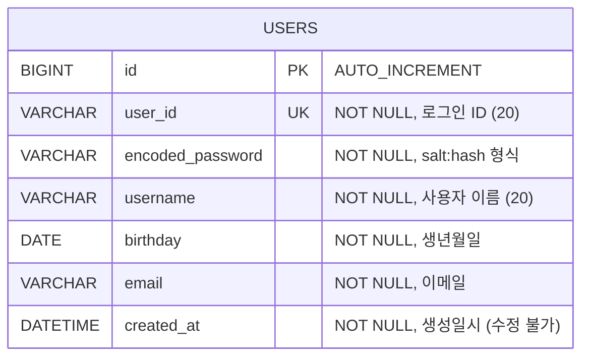
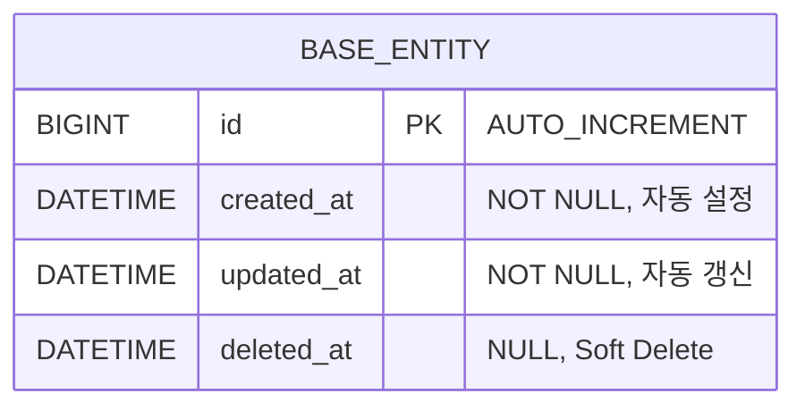
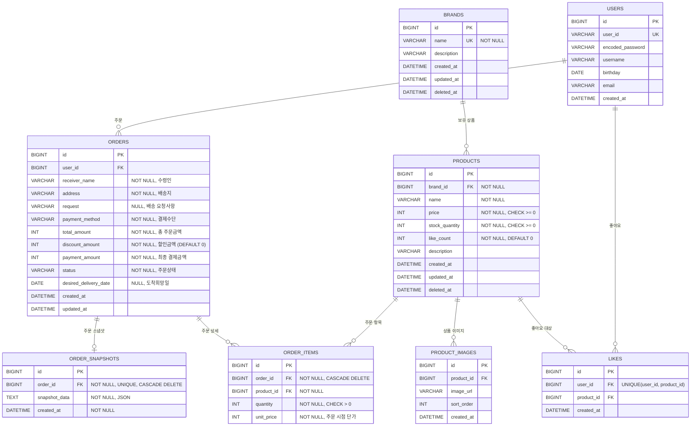

# 7. 전체 테이블 구조 및 관계 정리 (ERD)

현재 구현된 테이블 구조와 향후 확장될 테이블 관계를 정리합니다.

- **DB**: MySQL
- **DDL 전략**: local/test 환경은 `ddl-auto: create`, 운영 환경은 `ddl-auto: none` (수동 관리)
- **타임존**: UTC 기준 저장 (`hibernate.jdbc.time_zone: UTC`)

---

## 7-1. 현재 구현된 ERD



### 이 ERD에서 봐야 할 포인트

- `users` 테이블은 현재 유일하게 구현된 테이블이며, **도메인 검증은 전부 애플리케이션 레벨**에서 처리한다. DB 제약조건은 `NOT NULL`과 `UNIQUE` 정도만 걸려 있다.
- `WrongPasswordCount`는 DB에 저장하지 않는 설계 결정이 있다 — 이 트레이드오프가 어떤 의미인지 7-3에서 다룬다.

---

## 7-2. 테이블 상세 명세

### `users` 테이블

> JPA Entity: `UserJpaEntity` (`com.loopers.infrastructure.entity`)

| 컬럼명 | 타입 | 제약조건 | 설명 |
|---|---|---|---|
| `id` | `BIGINT` | `PK`, `AUTO_INCREMENT` | 내부 식별자 |
| `user_id` | `VARCHAR(20)` | `NOT NULL`, `UNIQUE` | 로그인 ID (영문 소문자+숫자 4~10자) |
| `encoded_password` | `VARCHAR(255)` | `NOT NULL` | 암호화된 비밀번호 (`salt:hash` 형식) |
| `username` | `VARCHAR(20)` | `NOT NULL` | 사용자 이름 (한글/영문/숫자 2~20자) |
| `birthday` | `DATE` | `NOT NULL` | 생년월일 (1900-01-01 이후, 미래 불가) |
| `email` | `VARCHAR(255)` | `NOT NULL` | 이메일 주소 |
| `created_at` | `DATETIME` | `NOT NULL`, `updatable = false` | 가입일시 (수정 불가) |

### DDL (예상)

```sql
CREATE TABLE users (
    id               BIGINT       NOT NULL AUTO_INCREMENT,
    user_id          VARCHAR(20)  NOT NULL,
    encoded_password VARCHAR(255) NOT NULL,
    username         VARCHAR(20)  NOT NULL,
    birthday         DATE         NOT NULL,
    email            VARCHAR(255) NOT NULL,
    created_at       DATETIME     NOT NULL,
    PRIMARY KEY (id),
    UNIQUE KEY uk_users_user_id (user_id)
);
```

### 인덱스

| 인덱스 | 타입 | 컬럼 | 용도 |
|---|---|---|---|
| `PRIMARY` | PK | `id` | 내부 식별자 |
| `uk_users_user_id` | UNIQUE | `user_id` | 로그인 ID 중복 방지 및 조회 |

---

## 7-3. 도메인 모델 ↔ 테이블 매핑

`UserJpaEntity`는 `BaseEntity`를 상속하지 않고 독자적으로 컬럼을 정의합니다.

```
Domain (User)                    DB (users)
─────────────                    ──────────
Long id                    →    id (BIGINT, PK)
UserId.value               →    user_id (VARCHAR)
String encodedPassword     →    encoded_password (VARCHAR)
UserName.value             →    username (VARCHAR)
Birthday.value             →    birthday (DATE)
Email.value                →    email (VARCHAR)
LocalDateTime createdAt    →    created_at (DATETIME)
─────────────────────────────────────────────
WrongPasswordCount         →    (DB에 미저장, 도메인 전용)
```

### 주의 사항

- **`WrongPasswordCount`**: 현재 DB에 컬럼이 없으며, 복원 시 항상 `WrongPasswordCount.init()` (0)으로 초기화됩니다.
- **`updated_at` / `deleted_at`**: `BaseEntity`에 정의되어 있지만 `UserJpaEntity`는 상속하지 않아 해당 컬럼이 없습니다.

### 데이터 정합성 검토

**현재 구현 (users)**

| 항목 | 현재 상태 | 리스크 |
|---|---|---|
| `email` UNIQUE 제약 없음 | 동일 이메일로 다중 가입 가능 | 이메일 기반 기능(비밀번호 찾기 등) 추가 시 정합성 깨짐 |
| `WrongPasswordCount` 미영속 | 서버 재시작/복원 시 항상 0으로 리셋 | 비밀번호 5회 오류 잠금 정책이 사실상 무력화됨 |
| `birthday` 검증이 앱 레벨에만 존재 | DB에는 어떤 날짜든 들어갈 수 있음 | 직접 SQL 삽입이나 마이그레이션 시 검증 우회 가능 |
| `updated_at` 컬럼 없음 | 비밀번호 변경 이력 추적 불가 | 감사(audit) 요구사항 발생 시 대응 어려움 |

**선택지**

- `email`에 UNIQUE 걸지 않은 건 의도적인 결정일 수 있다. 단, 향후 요구사항에 따라 `uk_users_email` 추가를 검토할 필요가 있다.
- `WrongPasswordCount`는 두 가지 방향이 있다:
  - **A) DB 컬럼 추가** → 영속화하여 재시작에도 유지. 단순하지만 매번 UPDATE 발생.
  - **B) Redis 캐시** → TTL 기반으로 일정 시간 후 자동 리셋. 별도 인프라 의존.
- `birthday` DB 레벨 제약은 `CHECK (birthday >= '1900-01-01' AND birthday <= CURDATE())`로 가능하지만, JPA `ddl-auto: create` 환경에서는 적용되지 않으므로 운영 DDL에서 관리해야 한다.

---

## 7-4. BaseEntity 공통 컬럼 (향후 테이블 확장 시 적용)

`modules/jpa`에 정의된 `BaseEntity`는 향후 새로운 엔티티가 상속받아 사용할 공통 컬럼입니다.



| 컬럼 | 동작 | 설명 |
|---|---|---|
| `created_at` | `@PrePersist` 시 자동 설정 | 최초 생성일시 (수정 불가) |
| `updated_at` | `@PrePersist`, `@PreUpdate` 시 자동 갱신 | 마지막 수정일시 |
| `deleted_at` | `delete()` 호출 시 설정, `restore()` 시 null | Soft Delete 지원 |

---

## 7-5. 향후 확장 ERD (미래 목표)

시퀀스 다이어그램 5-2 ~ 5-6에서 설계한 브랜드/상품/좋아요/주문 기능 구현 시 예상되는 테이블 구조입니다.



### 이 ERD에서 봐야 할 포인트

- `ORDERS`와 `ORDER_ITEMS`는 합성(Composition) 관계다. 주문이 삭제되면 주문 항목도 함께 사라져야 하므로 FK에 **CASCADE DELETE**를 명시했다. `ORDER_SNAPSHOTS`도 마찬가지.
- `LIKES`에 `UNIQUE(user_id, product_id)` 복합 유니크가 걸려 있다. 이것이 "유저당 1상품 1좋아요"를 DB 레벨에서 보장하는 핵심 제약이다.
- `ORDER_ITEMS.unit_price`는 주문 시점의 상품 단가를 스냅샷한다. `PRODUCTS.price`가 이후 변경되어도 주문 금액이 보존된다. `ORDER_SNAPSHOTS`와 함께 **주문 시점 불변성**을 이중으로 보장하는 구조다.
- `PRODUCTS.like_count`는 비정규화 컬럼이다. `COUNT(LIKES)`를 매번 조회하는 비용을 줄이기 위해 도입했지만, `LIKES` 테이블과의 **정합성 유지 책임**이 서비스 레이어에 생긴다.

### 정합성을 위해 적용한 DB 제약조건

| 테이블 | 제약 | 보장하는 것 |
|---|---|---|
| `BRANDS.name` | `UNIQUE` | 브랜드 이름 중복 방지 |
| `PRODUCTS.price` | `CHECK >= 0` | 음수 가격 방지 |
| `PRODUCTS.stock_quantity` | `CHECK >= 0` | 재고 음수 방지 (동시성은 앱 레벨에서 추가 보장 필요) |
| `LIKES(user_id, product_id)` | `UNIQUE` | 유저당 1상품 1좋아요 |
| `ORDER_ITEMS.quantity` | `CHECK > 0` | 0개 주문 방지 |
| `ORDER_ITEMS.order_id` | `FK CASCADE DELETE` | 주문 삭제 시 항목 자동 삭제 |
| `ORDER_SNAPSHOTS.order_id` | `FK CASCADE DELETE`, `UNIQUE` | 주문당 1스냅샷, 주문 삭제 시 자동 삭제 |

### 금액 정합성 규칙

```
ORDERS.total_amount   = SUM(ORDER_ITEMS.unit_price * ORDER_ITEMS.quantity)
ORDERS.payment_amount = ORDERS.total_amount - ORDERS.discount_amount
```

이 관계는 DB `CHECK` 제약으로 걸 수 없다 (cross-row 참조). 주문 생성 시 **서비스 레이어에서 계산하고 검증**해야 하며, 사후에 불일치가 발생하면 `ORDER_SNAPSHOTS`의 원본 데이터로 추적할 수 있다.

### 데이터 정합성 리스크 (향후 구현 시 검토)

| 항목 | 리스크 | 선택지 |
|---|---|---|
| `PRODUCTS.stock_quantity` 동시성 | `CHECK >= 0`만으로는 동시 주문 시 race condition 방지 불가 | **A)** `SELECT ... FOR UPDATE` 비관적 잠금 **B)** `UPDATE ... SET stock = stock - ? WHERE stock >= ?` 원자적 감소 |
| `PRODUCTS.like_count` ↔ `LIKES` 불일치 | 좋아요 생성/삭제 시 count 동기화가 깨질 수 있음 | **A)** 같은 트랜잭션에서 `LIKES` INSERT + `PRODUCTS.like_count` UPDATE **B)** 비동기 이벤트로 분리 (eventual consistency) |
| `PRODUCTS` Soft Delete + `ORDER_ITEMS` FK | 삭제된 상품의 주문 내역 조회 시 FK 참조 깨짐 | **A)** Soft Delete이므로 실제 삭제 안 됨 — 조회 시 `deleted_at IS NOT NULL` 필터링 **B)** `ORDER_SNAPSHOTS`에 상품 정보가 있으므로 FK 대신 스냅샷 활용 |
| `BRANDS` Soft Delete + `PRODUCTS.brand_id` FK | 브랜드 삭제 시 하위 상품 처리 정책 필요 | **A)** Cascade Soft Delete — 브랜드 삭제 시 상품도 함께 Soft Delete **B)** 브랜드에 상품이 남아있으면 삭제 차단 |
| `ORDERS.discount_amount` 근거 없음 | 쿠폰 제거 후 할인 금액의 산출 근거가 불명확 | 할인 정책이 없다면 컬럼 제거 검토. 있다면 `discount_type` 등으로 근거를 남겨야 함 |
| `ORDERS.status` VARCHAR | 문자열이라 오타/잘못된 값 입력 가능 | **A)** `ENUM` 타입 사용 — DB 레벨 보장, 마이그레이션 시 변경 어려움 **B)** VARCHAR 유지 + 앱 레벨 검증 — 유연하지만 DB 정합성 약함 |

> 위 ERD는 미래 구현 목표이며, 실제 구현 시 도메인 설계에 따라 변경될 수 있습니다.
