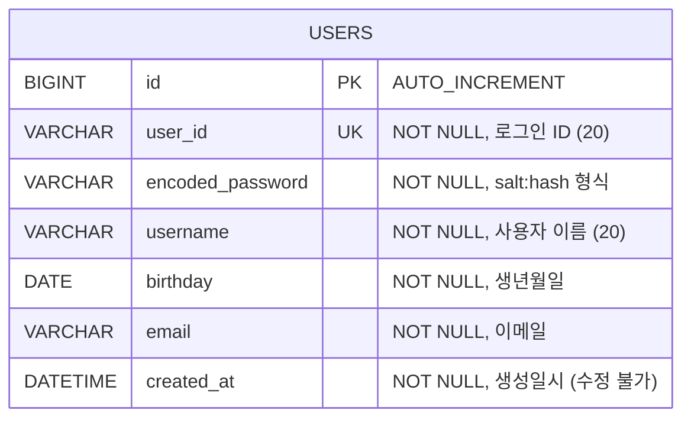
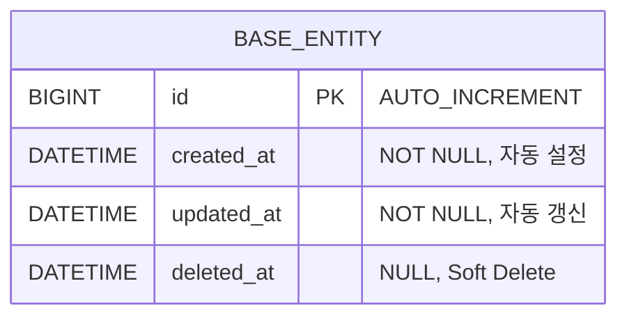
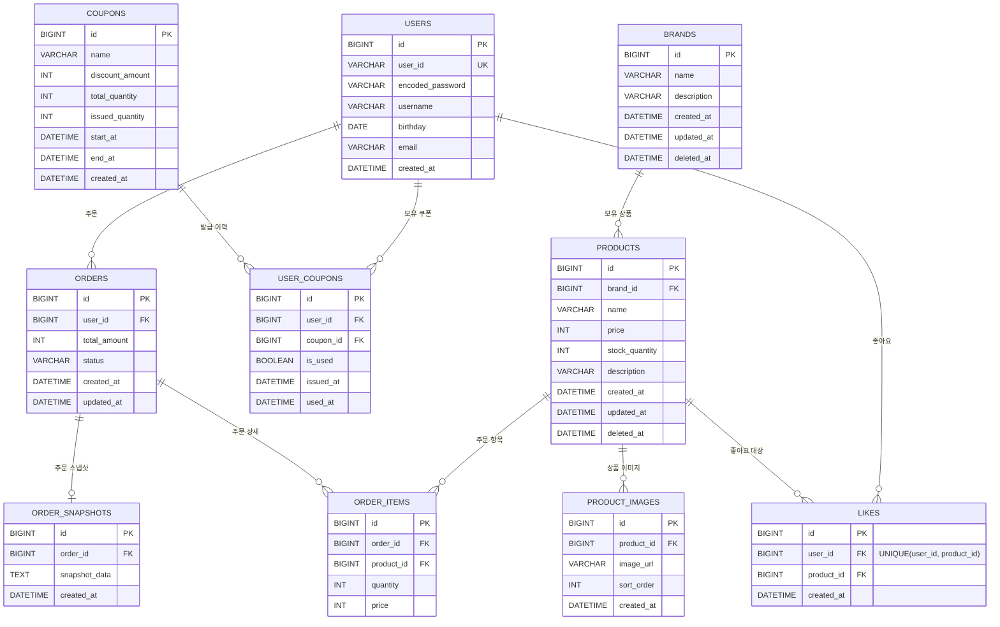

# 7. 전체 테이블 구조 및 관계 정리 (ERD)

현재 구현된 테이블 구조와 향후 확장될 테이블 관계를 정리합니다.

- **DB**: MySQL
- **DDL 전략**: local/test 환경은 `ddl-auto: create`, 운영 환경은 `ddl-auto: none` (수동 관리)
- **타임존**: UTC 기준 저장 (`hibernate.jdbc.time_zone: UTC`)

---

## 7-1. 현재 구현된 ERD



---

## 7-2. 테이블 상세 명세

### `users` 테이블

> JPA Entity: `UserJpaEntity` (`com.loopers.infrastructure.entity`)

| 컬럼명 | 타입 | 제약조건 | 설명 |
|---|---|---|---|
| `id` | `BIGINT` | `PK`, `AUTO_INCREMENT` | 내부 식별자 |
| `user_id` | `VARCHAR(20)` | `NOT NULL`, `UNIQUE` | 로그인 ID (영문 소문자+숫자 4~10자) |
| `encoded_password` | `VARCHAR(255)` | `NOT NULL` | 암호화된 비밀번호 (`salt:hash` 형식) |
| `username` | `VARCHAR(20)` | `NOT NULL` | 사용자 이름 (한글/영문/숫자 2~20자) |
| `birthday` | `DATE` | `NOT NULL` | 생년월일 (1900-01-01 이후, 미래 불가) |
| `email` | `VARCHAR(255)` | `NOT NULL` | 이메일 주소 |
| `created_at` | `DATETIME` | `NOT NULL`, `updatable = false` | 가입일시 (수정 불가) |

### DDL (예상)

```sql
CREATE TABLE users (
    id               BIGINT       NOT NULL AUTO_INCREMENT,
    user_id          VARCHAR(20)  NOT NULL,
    encoded_password VARCHAR(255) NOT NULL,
    username         VARCHAR(20)  NOT NULL,
    birthday         DATE         NOT NULL,
    email            VARCHAR(255) NOT NULL,
    created_at       DATETIME     NOT NULL,
    PRIMARY KEY (id),
    UNIQUE KEY uk_users_user_id (user_id)
);
```

### 인덱스

| 인덱스 | 타입 | 컬럼 | 용도 |
|---|---|---|---|
| `PRIMARY` | PK | `id` | 내부 식별자 |
| `uk_users_user_id` | UNIQUE | `user_id` | 로그인 ID 중복 방지 및 조회 |

---

## 7-3. 도메인 모델 ↔ 테이블 매핑

`UserJpaEntity`는 `BaseEntity`를 상속하지 않고 독자적으로 컬럼을 정의합니다.

```
Domain (User)                    DB (users)
─────────────                    ──────────
Long id                    →    id (BIGINT, PK)
UserId.value               →    user_id (VARCHAR)
String encodedPassword     →    encoded_password (VARCHAR)
UserName.value             →    username (VARCHAR)
Birthday.value             →    birthday (DATE)
Email.value                →    email (VARCHAR)
LocalDateTime createdAt    →    created_at (DATETIME)
─────────────────────────────────────────────
WrongPasswordCount         →    (DB에 미저장, 도메인 전용)
```

### 주의 사항

- **`WrongPasswordCount`**: 현재 DB에 컬럼이 없으며, 복원 시 항상 `WrongPasswordCount.init()` (0)으로 초기화됩니다.
- **`updated_at` / `deleted_at`**: `BaseEntity`에 정의되어 있지만 `UserJpaEntity`는 상속하지 않아 해당 컬럼이 없습니다.

---

## 7-4. BaseEntity 공통 컬럼 (향후 테이블 확장 시 적용)

`modules/jpa`에 정의된 `BaseEntity`는 향후 새로운 엔티티가 상속받아 사용할 공통 컬럼입니다.



| 컬럼 | 동작 | 설명 |
|---|---|---|
| `created_at` | `@PrePersist` 시 자동 설정 | 최초 생성일시 (수정 불가) |
| `updated_at` | `@PrePersist`, `@PreUpdate` 시 자동 갱신 | 마지막 수정일시 |
| `deleted_at` | `delete()` 호출 시 설정, `restore()` 시 null | Soft Delete 지원 |

---

## 7-5. 향후 확장 ERD (미래 목표)

시퀀스 다이어그램 5-2, 5-3에서 설계한 브랜드/상품/주문/쿠폰 기능 구현 시 예상되는 테이블 구조입니다.



> 위 ERD는 미래 구현 목표이며, 실제 구현 시 도메인 설계에 따라 변경될 수 있습니다.
