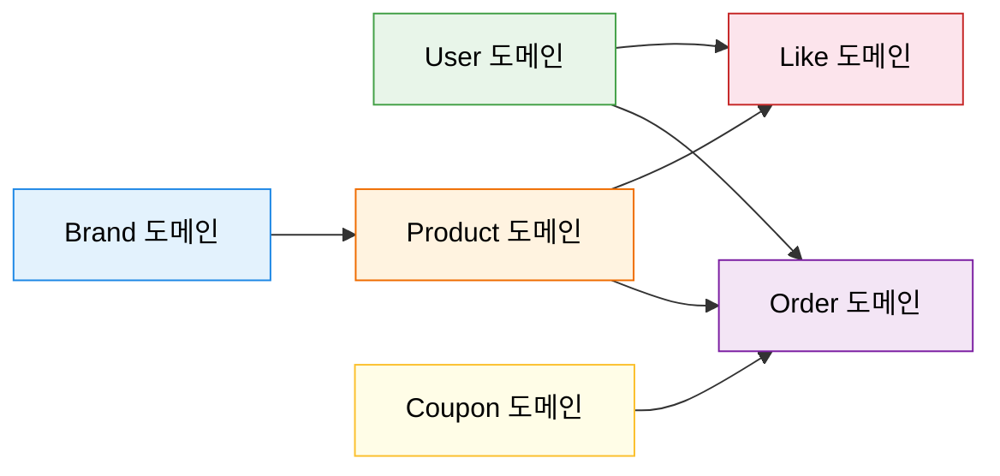
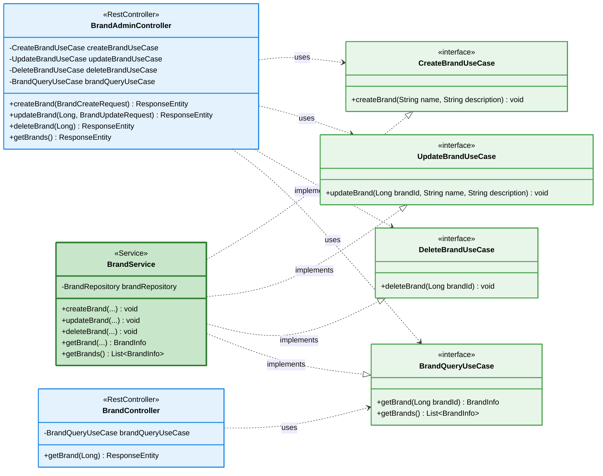
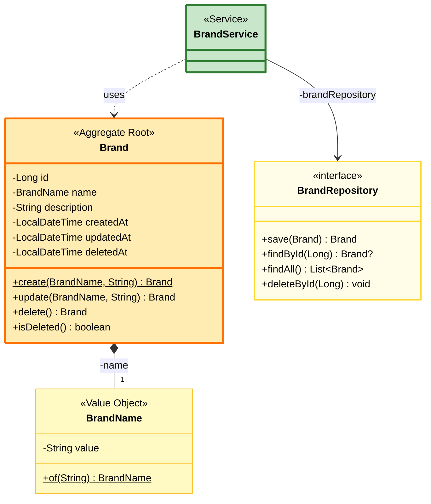
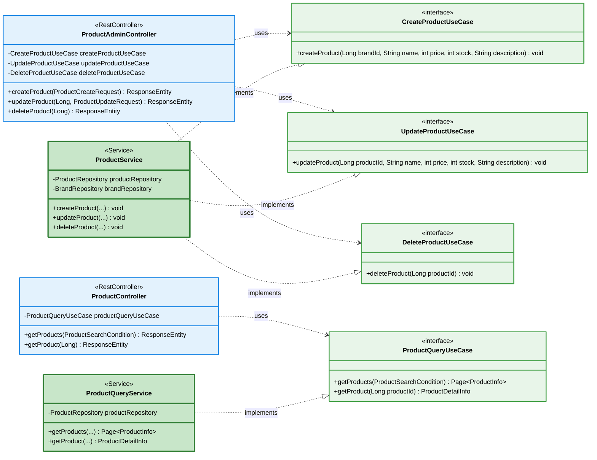
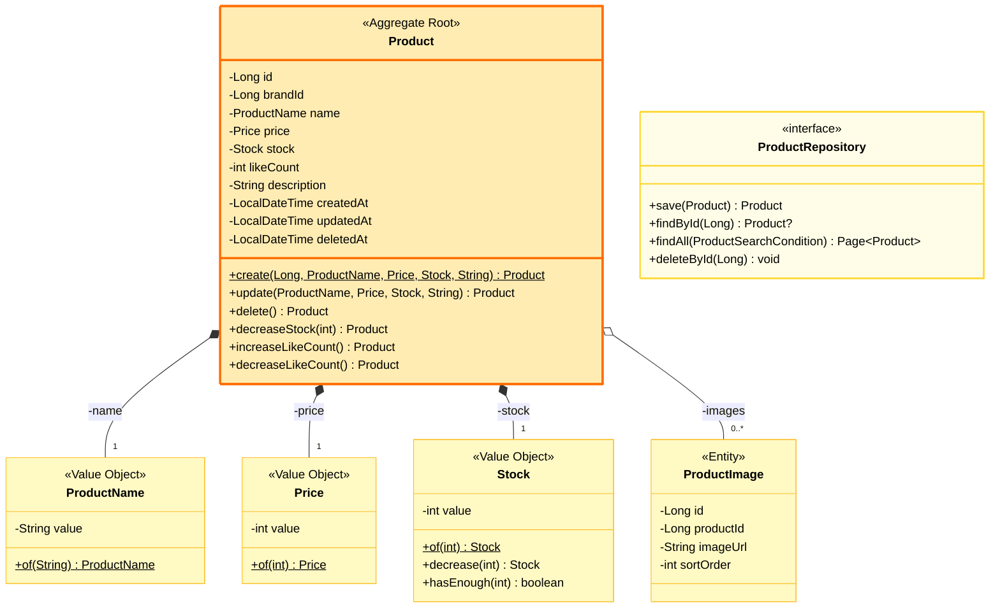
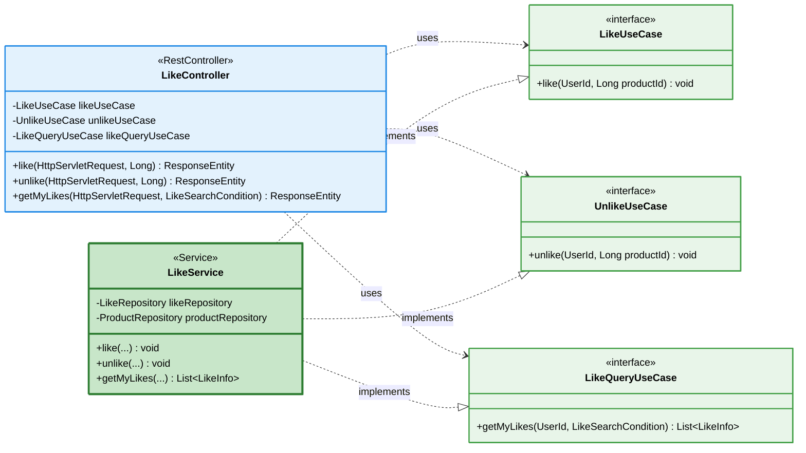
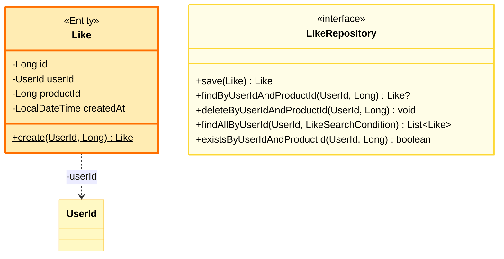
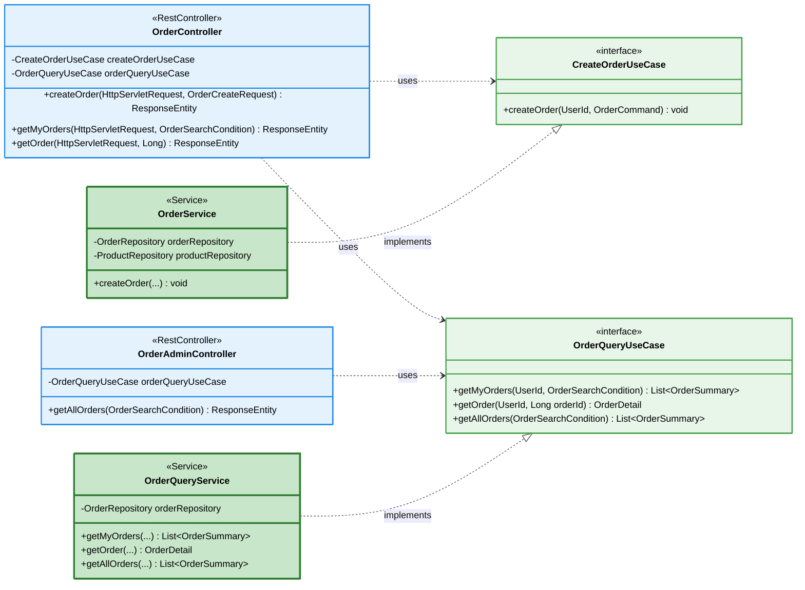
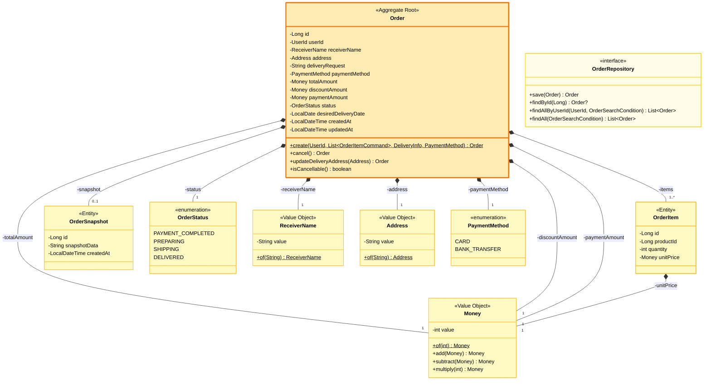
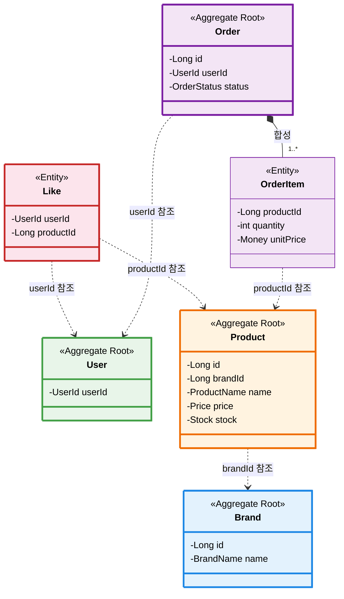

# 향후 도메인 확장 클래스 다이어그램

요구사항 명세서(01-requirements.md)에 정의된 브랜드, 상품, 좋아요, 주문 도메인의 설계입니다.
현재 User 도메인과 동일한 클린 아키텍처 패턴(UseCase 인터페이스 + Service 구현 + Domain Port)을 적용합니다.

---

## 전체 도메인 맵



---

## Part 1. Brand 도메인

### 1-1. Interfaces → Application



### 1-2. Domain



### 설계 포인트

- Admin과 User가 별도 Controller를 가진다. Admin은 CRUD 전체, User는 조회만 가능.
- Brand 삭제는 Soft Delete (`deletedAt` 설정). 하위 Product도 Cascade Soft Delete 처리 필요.
- `BrandName`은 Value Object로 중복 검증 로직을 캡슐화.

---

## Part 2. Product 도메인

### 2-1. Interfaces → Application



### 2-2. Domain



### 설계 포인트

- **Command/Query 분리**: `ProductService`(CUD)와 `ProductQueryService`(R)를 분리하여 읽기 최적화와 쓰기 트랜잭션을 독립시킨다.
- `brandId`는 Product가 Brand Aggregate를 직접 참조하지 않고 **ID 참조**로 연결. Aggregate 간 결합도를 낮춘다.
- `Stock` Value Object에 `decrease()`, `hasEnough()` 로직을 캡슐화하여 재고 관련 규칙이 도메인에 집중된다.
- `likeCount`는 비정규화 필드. LIKES 테이블과의 정합성은 서비스 레이어에서 트랜잭션으로 보장.
- Admin에서 상품 등록 시 `brandId` 존재 여부를 `BrandRepository`로 검증한다.
- 브랜드 변경 불가(`Immutable`) — `update()`에 brandId 파라미터 없음.

---

## Part 3. Like 도메인

### 3-1. Interfaces → Application



### 3-2. Domain



### 설계 포인트

- Like는 독립 Aggregate가 아닌 **Entity**. User와 Product 사이의 관계를 표현하되, 양쪽 Aggregate를 ID 참조로만 연결.
- **Idempotency**: `like()` 호출 시 이미 좋아요가 존재하면 예외 대신 무시 (또는 409 Conflict).
- Like 생성/삭제 시 `Product.likeCount`를 같은 트랜잭션에서 증감하여 정합성 보장.
- Controller는 `HttpServletRequest`에서 `authenticatedUserId`를 꺼내 사용 (Interceptor 패턴).

---

## Part 4. Order 도메인

### 4-1. Interfaces → Application



### 4-2. Domain



### 설계 포인트

- **Order가 Aggregate Root**, OrderItem과 OrderSnapshot은 Order 생명주기에 종속된 Entity.
- **주문 생성 프로세스**: 재고 확인 → 재고 차감 → (쿠폰 적용) → 금액 검증 → 주문 생성. 이 전체가 하나의 트랜잭션.
- `OrderItem.unitPrice`는 주문 시점 스냅샷. `Product.price` 변경에 영향받지 않음.
- `OrderSnapshot`은 주문 시점의 전체 상품 정보를 JSON으로 보관.
- **상태 전이 규칙**: `PAYMENT_COMPLETED`/`PREPARING`에서만 취소/배송지 변경 가능. `SHIPPING`/`DELIVERED`에서는 불가.
- `Money` Value Object로 금액 연산을 캡슐화하여 금액 관련 실수 방지.

---

## Part 5. 도메인 간 관계 종합



### Aggregate 간 참조 규칙

| 참조 | 방식 | 이유 |
|---|---|---|
| Product → Brand | `brandId` (Long) | 다른 Aggregate를 직접 참조하지 않아 결합도 최소화 |
| Like → User | `userId` (UserId) | User Aggregate의 식별자만 사용 |
| Like → Product | `productId` (Long) | Product Aggregate의 식별자만 사용 |
| Order → User | `userId` (UserId) | 주문자 식별 |
| OrderItem → Product | `productId` (Long) | 주문 시점 단가를 OrderItem에 스냅샷 |

---

## 향후 확장 패키지 구조

```
com.loopers/
├── application/
│   ├── service/
│   │   ├── UserService.java              (Register, Query, PasswordUpdate)
│   │   ├── AuthenticationService.java     (Authentication)
│   │   ├── BrandService.java             (Brand CRUD)
│   │   ├── ProductService.java           (Product CUD)
│   │   ├── ProductQueryService.java      (Product 조회)
│   │   ├── LikeService.java             (좋아요 등록/취소/조회)
│   │   ├── OrderService.java            (주문 생성)
│   │   └── OrderQueryService.java       (주문 조회)
│   ├── AuthenticationUseCase.java
│   ├── RegisterUseCase.java
│   ├── PasswordUpdateUseCase.java
│   ├── UserQueryUseCase.java
│   ├── CreateBrandUseCase.java
│   ├── UpdateBrandUseCase.java
│   ├── DeleteBrandUseCase.java
│   ├── BrandQueryUseCase.java
│   ├── CreateProductUseCase.java
│   ├── UpdateProductUseCase.java
│   ├── DeleteProductUseCase.java
│   ├── ProductQueryUseCase.java
│   ├── LikeUseCase.java
│   ├── UnlikeUseCase.java
│   ├── LikeQueryUseCase.java
│   ├── CreateOrderUseCase.java
│   └── OrderQueryUseCase.java
├── domain/
│   ├── model/
│   │   ├── user/     (User, UserId, UserName, Password, Email, Birthday, ...)
│   │   ├── brand/    (Brand, BrandName)
│   │   ├── product/  (Product, ProductName, Price, Stock, ProductImage)
│   │   ├── like/     (Like)
│   │   └── order/    (Order, OrderItem, OrderSnapshot, OrderStatus, Money, ...)
│   ├── repository/
│   │   ├── UserRepository.java
│   │   ├── BrandRepository.java
│   │   ├── ProductRepository.java
│   │   ├── LikeRepository.java
│   │   └── OrderRepository.java
│   └── service/
│       └── PasswordEncoder.java
├── infrastructure/
│   ├── entity/        (각 도메인별 JPA Entity)
│   ├── repository/    (각 도메인별 JPA Repository)
│   └── security/
├── interfaces/api/
│   ├── UserController.java
│   ├── BrandController.java
│   ├── BrandAdminController.java
│   ├── ProductController.java
│   ├── ProductAdminController.java
│   ├── LikeController.java
│   ├── OrderController.java
│   ├── OrderAdminController.java
│   ├── interceptor/
│   │   └── AuthenticationInterceptor.java
│   ├── config/
│   │   └── WebMvcConfig.java
│   └── dto/
└── support/error/
```

### Interceptor 경로 확장

```java
// WebMvcConfig - 인증 필요 경로 등록
registry.addInterceptor(authenticationInterceptor)
    .addPathPatterns(
        "/api/v1/users/me",
        "/api/v1/users/me/**",
        "/api/v1/products/*/likes",
        "/api/v1/orders/**"
    );
```

### 설계 원칙 요약

| 원칙 | 적용 |
|---|---|
| **Aggregate 간 ID 참조** | 직접 객체 참조 대신 ID로 연결하여 결합도 최소화 |
| **UseCase 인터페이스 분리 (ISP)** | 각 기능별 인터페이스로 Controller가 필요한 것만 의존 |
| **Command/Query 분리** | 쓰기와 읽기 Service를 분리하여 각각 최적화 가능 |
| **Value Object 활용** | 도메인 규칙을 VO에 캡슐화하여 유효성 보장 |
| **횡단 관심사 분리** | 인증은 Interceptor, 비즈니스는 Service |
| **도메인별 Service** | 각 도메인이 독립 Service를 가져 비대화 방지 |
